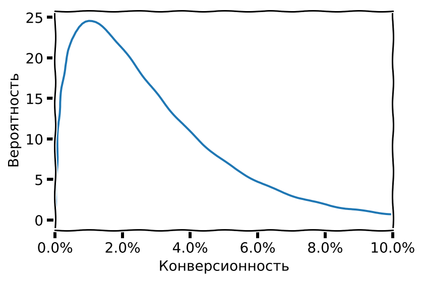
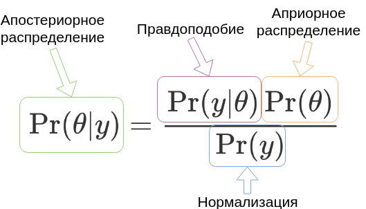

+++
title = "Конверсия и data science I. Как увидеть невидимое."
subtitle = "Или каким цифрам можно верить?"
date = 2018-12-20T00:00:00
tags=['Conversion']
categories=['Internet analytics']
summary = ""
# Optional featured image (relative to `static/img/` folder).
[header]
image = ""
caption = ""

+++
# Введение
Этой статьей я начинаю цикл о проблемах Интернет-аналитики (аналитики в широком смысле: аналитика
сайтов, аналитика мобильных приложений, игровая аналитика и т.п.) и возможных способах
их решения с позиций современного data science. Над этими проблемами
я начал размышлять давно, ещё когда делал свои первые проекты по
 интернет-аналитике, а потом когда создавал Вебвизор и работал в Яндекс.Метрике.
Но до практического
их решения я добрался только сейчас, когда появилось время на изучение
нужной литературы и расширение своего кругозора. Можно сказать,
что появилась возможность закрыть гештальт, и я рад ей воспользоваться.

Несмотря на бурное развитие data science и машинного обучения, 
современная Интернет-аналитика по большей части осталась такой же, как
и 10 лет назад. Те же отчеты, графики, сегментирование, и т.д.
По большому счёту это просто удобный интерфейс к табличной базе данных с функциями
агрегации и выборки нужных сегментов. Всё осмысление выдаваемых отчётами
цифр ложится на плечи пользователя. Между тем, напрямую
глядя на эти цифры, можно получить на так уж много полезной информации, и гораздо больше бесполезной.
Я попробую описать методики
работы с этими сырыми данными (и по возможности создать практическую реализацию этих методик),
чтобы повысить value современной интернет-аналитики, сделать её более 
полезной и информативной. 

## Терминология
В русской терминологии существует некоторая путаница, словом "конверсия"
может обозначаться и событие совершения посетителем целевого действия (достижение цели)
и соотношение кол-ва визитов, где произошла конверсия, к общему количеству визитов (conversion rate, коэффициент конверсии, показатель конверсии).
Чтобы избежать неоднозначности, я буду использовать для соотношения 
$\frac{визиты\,с\,конверсией}{все\,визиты}$ термин
__конверсионность__, как меру способности входящего трафика генерировать конверсии,
а для события достижения цели - слово __конверсия__ (т.е. так же, 
как его использует Google Analytics). 


# Проблема измерения конверсионности
Итак, конверсионность, или коэффициент конверсии (в терминах Google Analytics),
или просто конверсия (в терминах Яндекс.Метрики), это отношение количества
"конверсионных", достигших цели визитов к общему количеству визитов. Вместо визитов
могут быть посетители, конверсией может быть покупка товара в магазине,
регистрация, приобретение артефакта в игре, суть от этого не меняется.
Конверсионность обычно рассматривают в разрезе источников трафика, собственно
это основной показатель качества источника. Чем выше конверсионность,
тем лучше. Если бы конверсионность измерялась на основе непрерывных физических величин,
таких как градусы или километры, на этом можно было бы завершить рассказ
и перейти к более интересным темам. Проблема в том, что и конверсии и визиты, 
на основе которых измеряют конверсионность, это дискретные события, а конверсии
еще и относительно редкие.

Если есть два визита и ноль достижений цели, это означает, что конверсионность источника равна нулю и его надо немедленно отключить?
А если один визит и одно достижение цели, то конверсионность 100%? Мы нашли курицу, несущую золотые яйца, и надо отключить все другие источники, кроме этого? 
С точки зрения здравого смысла - нет, надо еще подождать, и тогда станет более ясно.
Но сколько подождать? Если есть 10 визитов, уже можно верить конверсионности, или ещё нет?
Или надо сто визитов? Тысячу визитов? 

Увы, современная интернет-аналитика 
не дает сколько нибудь внятного ответа на такой простой вопрос, возникающий каждый раз
 оценке конверсионности недавно появившихся или просто слабых источников трафика, а также
 при подключении новых рекламных объявлений. Будем искать ответ сами.

# Конверсионность как вероятность
Посмотрим на конверсии, как на вероятностный процесс. Будем считать каждый визит
на сайт попыткой конверсии. Т.е. посетитель, приходящий на сайт, может сконвертироваться, а может и не сконвертироваться.
Вероятность конверсии это и есть конверсионность, принимающая значения от 0 до 1 (или от 0% до 100%).
Вероятность успехов (конверсий) в ходе независимых попыток описывается простейшим
[распределением Бернулли](https://ru.wikipedia.org/wiki/%D0%A0%D0%B0%D1%81%D0%BF%D1%80%D0%B5%D0%B4%D0%B5%D0%BB%D0%B5%D0%BD%D0%B8%D0%B5_%D0%91%D0%B5%D1%80%D0%BD%D1%83%D0%BB%D0%BB%D0%B8):
 $$\Pr(X=1)=p=1-\Pr(X=0)$$
 где $X$ это случайная величина, которая
принимает одно из двух значений: $1$ (успех, произошла конверсия) или $0$ (неудача, конверсии не было), а $p$ это вероятность 
успеха, она же конверсионность в нашем случае. Выражение $\Pr(X=y)$ означает *"вероятность того, что
 случайная величина $X$ окажется равна $y$"*.

Обычно интересны не единичные события, а то, что происходит на некотором
интервале времени. Допустим, на сайт пришло 1000 посетителей из источника с конверсионностью 0.01, или 1% 
(сейчас предположим, что нам известно точное значение конверсионности).
Сколько посетителей сконвертируется? Ровно 10? Совсем не обязательно. Количество
успехов из $n$ попыток, с вероятностью успеха каждой попытки, равной $p$, описывается [биномиальным
распределением](https://ru.wikipedia.org/wiki/%D0%91%D0%B8%D0%BD%D0%BE%D0%BC%D0%B8%D0%B0%D0%BB%D1%8C%D0%BD%D0%BE%D0%B5_%D1%80%D0%B0%D1%81%D0%BF%D1%80%D0%B5%D0%B4%D0%B5%D0%BB%D0%B5%D0%BD%D0%B8%D0%B5):
$X \sim \mathrm{Bin}(n,p)$. 
Соответственно, вероятность получить $k$ конверсий описывается функцией
вероятности биномиального распределения:
$$\Pr(X=k)={n\choose k}p^k(1-p)^{n-k}$$
$$\binom n k =\frac{n!}{k!(n-k)!}$$
Второе выражение это [биномиальный коэффициент](https://ru.wikipedia.org/wiki/%D0%91%D0%B8%D0%BD%D0%BE%D0%BC%D0%B8%D0%B0%D0%BB%D1%8C%D0%BD%D1%8B%D0%B9_%D0%BA%D0%BE%D1%8D%D1%84%D1%84%D0%B8%D1%86%D0%B8%D0%B5%D0%BD%D1%82), который и дал название распределению.
Выглядит страшновато, но ничего сверхъестественного в этих формулах нет. Представим,
что каждая попытка это подбрасывание монетки, успех если выпал орёл, неуспех если решка.
Если подбрасываем монетку один раз, имеем 50% вероятность успеха.
Если подбрасываем два раза, есть четыре варианта развития событий:
`орёл-орёл`, `орёл-решка`, `решка-орёл`, `решка-решка`. То есть 25% вероятность
получить два успеха, 50% вероятность получить один успех и 25% вероятность получить ноль успехов.
Можно продолжать и дальше, но то, что мы посчитали, это уже биномиальное распределение
для $n=2$ и $p=0.5$!

Формула биномиального распределения просто задаёт обобщенный способ такого расчёта,
для любых $n$ и $p$. 

Распределение Бернулли это частный случай биномиального распределения для единичной попытки ($n=1$),
поэтому эти распределения взаимозаменяемы. Обычно распределение Бернулли используют, когда рассматривают
единичные события, а биномиальное - когда рассматривают сразу много событий, например все визиты за день.

Вернёмся к конверсиям, и построим график вероятности количества конверсий для наших 1000 визитов,
т.е. $n=1000$ и $p=0.01$ (конверсионность 1%)



Вероятность получить ровно 10 конверсий - всего 12.6%! Примерно такая же
вероятность получить 9 конверсий, а вообще можно получить любое число 
от 0 до примерно 21.  

В чём же дело?

# Конверсионность как матожидание
На самом деле существует две конверсионности. Первая это параметр $p$ в распределении
Бернулли и биномиальном распределении, определяющий вероятность
конверсии посетителя. Назовём его истинной конверсионностью. Для распределения
Бернулли, описывающего и конверсию и бросание монеты, параметр $p$ равен
 математическому ожиданию случайной переменной:
$$p=\mathrm{E}(X)$$
Вторая конверсионность - это реализованная (наблюдаемая) конверсионность, т.е. результаты "подбрасывания монетки".
Та самая цифра, которую мы видим в отчётах Метрики и Google Analytics под названием *"конверсия"* и *"коэффициент конверсии"*,
являющаяся средним количеством конверсий на $n$ визитов. Визуализацию того, как
эта конверсионность соотносится с первой, истинной конверсионностью,
мы только что сделали (биномиальное распределение).

На практике математическое ожидание обычно считают эквивалентным среднему значению,
но это не совсем так. Согласно [Закону больших чисел](https://ru.wikipedia.org/wiki/%D0%97%D0%B0%D0%BA%D0%BE%D0%BD_%D0%B1%D0%BE%D0%BB%D1%8C%D1%88%D0%B8%D1%85_%D1%87%D0%B8%D1%81%D0%B5%D0%BB)
среднее значение стремится к матожиданию на бесконечно большой выборке:
$$\\frac{1}{n} \\sum_{i=1}^n X_i \\rightarrow \mathrm{E}\[ X \], \\quad n \\rightarrow \\infty$$

Но закон больших чисел ничего не говорит о том, __насколько быстро__ среднее
сойдется к матожиданию. Для многих распределений, встречающихся в жизни,
по выборке из 100 значений уже можно вполне точно оценить матожидание.
Но интернет-аналитике здесь не повезло, распределение Бернулли с маленьким
значением $p$ это как раз пример __медленного__ схождения. Проиллюстрируем
это графически.  



На диаграмме изображена наблюдаемая конверсионность для 10 источников трафика
с одинаковой истинной конверсионностью, равной 1%. Каждый источник случайным образом берет
(сэмплирует) конверсии из распределения Бернулли с $p=0.01$. Это модель
*реальных* источников и *реальных* цифр в отчётах. 
Как видно, до 100
визитов значения конверсионности почти случайны, к 1000 визитов они наконец
группируются вокруг истинного значения, но только к 100 000 визитов ($10^5$)
наблюдается более-менее полное схождение к точному значению. Повторюсь, 
__сто тысяч визитов__. Многие ли дожидаютя 100К визитов, прежде чем оценить конверсионность?

В реальности всё ещё хуже, т.к. за время, которое пройдет до 
набирания 100К визитов, свойства источника скорее всего успеют измениться
(например там появится другая аудитория), и истинная конверсионность тоже изменится.
Узнать правду (истинную конверсионность) в такой ситуации вообще невозможно.



Если конверсионность менее одного процента (на последнем графике смоделирована
истинная конверсионность 0.2%), ситуация усугубляется. Стабилизация значений наступает только
к 10000 визитов.

Чтобы нагляднее оценить неточность наблюдаемой конверсионности, построим графики биномиальных
распределений при фиксированном $p$ и разных $n$ в сравнимом масштабе по осям X и Y.
Для этого разделим значения по оси X (кол-во конверсий)
на количество визитов $n$, и получим как раз возможные наблюдаемые значения конверсионности
при заданном истинном значении. Значения по оси Y наоборот умножим на кол-во визитов:


       
Все графики построены для истинной конверсионности 1%. Видно, что когда есть только 100 визитов, 
у нас примерно одинаковые шансы наблюдать конверсионность и 0% и 1%, а также ощутимая
возможность увидеть конверсионность 2%, 3% и более. Для 1000 визитов значения уже 
явно сгруппированы вокруг истинной конверсионности (но пока в диапазоне плюс-минус километр),
 ну а для 10000 визитов уже есть 
хороший шанс увидеть относительно точное значение истинной конверсионности. 

Итак, биномиальное распределение говорит нам, какие наблюдаемые значения
конверсионности можно получить при заданном истинном значении. Но на практике
обычно требуется решение обратной задачи: есть наблюдаемые (неточные) значения конверсионности,
на основе которых надо оценить истинную (точную) конверсионность.
Эту задача наиболее удобно решается с помощью Байесовского подхода.

 
# Конверсионность как апостериорное распределение
Давайте отложим в сторону теорию вероятностей, и посмотрим, как работают
с конверсией обычные люди. Представим, что есть человек, профессионально занимающийся
закупками трафика и ведением рекламных кампаний (назовём его Трафик-менеджер), у
него есть история предыдущих объявлений в Директе, средняя наблюдаемая конверсия там в районе 2%.
 
* Подключается новое объявление и набирает два визита и ноль достижений цели. Какая у него конверсия?
Трафик менеджер скажет, что пока у нас маловато данных, чтобы делать какие то выводы,
но скорее всего конверсия будет в районе 1-5%, потому что у всех других объявлений
она была в этом диапазоне. Но точно не 50%, и вероятно не 0%, несмотря на то,
что прямо сейчас она равна нулю.
* Затем объявление набирает 10 визитов из них 2 конверсии. Трафик-менеджер скажет,
что это объявление имеет шансы быть хорошим, конверсия точно не ноль, но скорее всего и не 20%,
потому что такая конверсия выглядит нереалистично, более реально иметь конверсию 2-6%.
* Объявление набирает 100 визитов, из них 4 конверсии. Трафик-менеджер скажет, что
конверсия объявления в районе 3-5%, но надо подождать ещё, цифра может измениться.
* И наконец, когда объявление наберет 1000 визитов из них 35 конверсий, трафик-менеджер скажет,
что достаточно уверен в конверсии около 3.5%. Но последняя цифра скорее всего ещё изменится,
и будет например 3.3% или 3.7%.

Рассуждения нашего трафик-менеджера это не что иное, как *байесовский подход* к решению проблемы,
применяемый на интуитивном уровне! В чём он заключается?

1. Есть вероятностная модель, содержащая ненаблюдаемые напрямую параметры (их
называют латентными, или [скрытыми переменными](https://ru.wikipedia.org/wiki/%D0%A1%D0%BA%D1%80%D1%8B%D1%82%D0%B0%D1%8F_%D0%BF%D0%B5%D1%80%D0%B5%D0%BC%D0%B5%D0%BD%D0%BD%D0%B0%D1%8F))
и описание, как эти параметры связаны с наблюдаемыми величинами.
В нашем случае единственный параметр это $p$, вероятность конверсии. Наблюдаемые величины
это количество событий `визит` и `конверсия`, они связаны с $p$ биномиальным распределением. 
Задача - на основе данных о наблюдаемых величинах получить оценку значений ненаблюдаемых (латентных) параметров.
Оценка всегда имеет вид распределения вероятностей.

2. Есть некоторая информация о диапазоне возможных значений параметров и 
приблизительной вероятности того или иного значения, основанная на предыдущем опыте.
Если мы попросим нашего трафик-менеджера визуализировать его представления о том, какой вообще может быть
конверсионность, он нарисует примерно такой график:
Эта информация называется *априорное распределение*. Априорное распределение, как правило,
имеет большую дисперсию (график "размазан" вдоль оси X) и таким образом выражает низкую уверенность в конкретных значениях:
конверсионность может быть и 1%, и 2%, и 3%, и больше. 

3. Через модель прогоняются данные в виде наблюдаемых значений, и априорное распределение модифицируется
  таким образом, чтобы лучше соответствовать данным (т.е. чтобы повысить [правдоподобие](https://en.wikipedia.org/wiki/Likelihood_function) модели). 
Чем больше данных прогоняется через модель, тем сильнее модифицируется априорное распределение.
Получившееся распределение, учитывающее и априорное знание, и реальные наблюдения, называется *апостериорное распределение*
(о происхождении терминов *априорный* и *апостериорный* можно прочитать в [Википедии](https://ru.wikipedia.org/wiki/%D0%90%D0%BF%D1%80%D0%B8%D0%BE%D1%80%D0%B8)).
Если все данные недоступны сразу (в нашем случае рекламная кампания идет в реальном времени и 
данные поступают порциями, например раз в день), то апостериорное распределение, полученное
после одной порции данных, может использоваться как априорное для следующей порции, и т.д.
Это соответствует тому, как наш трафик-менеджер постепенно уточняет свою оценку по мере поступления данных.
  
4. Полученное в итоге апостериорное распределение и является оптимальной оценкой того, 
 какие значения могут быть у параметров модели. Обычно апостериорное распределение имеет более узкую и вытянутую
 форму по сравнению с априорным (пример - приведённый выше график биномиального распределения для 10000 визитов), отражая
 рост уверенности в конкретном диапазоне значений параметра. Если данных много, 
 то форма апостериорного распределения практически не зависит от формы априорного. Если наоборот мало,
 то апостериорное распределение будет близко к априорному.
  
Собственно, это вся суть байесовского подхода к анализу данных. Процесс получения апостериорного распределения
называют еще байесовским выводом (bayesian inference).
Осталось только выразить всё это в виде формул, чтобы можно было автоматически
рассчитывать параметры конверсионности, не прибегая к интуиции 
трафик-менеджера. 


# Теорема Байеса
Я намеренно описал байесовский подход на практических примерах, а
не на основе теоремы Байеса, т.к. для полного понимания этой теоремы 
нужно приличное знание тервера, которое есть не у всех потенциальных
читателей этой статьи. А если оно есть, то и теорема Байеса таким
читателям вероятно знакома. Но на всякий случай кратко изложу:

$$\Pr(\theta|y)=\frac{\Pr(y|\theta)\Pr(\theta)}{\Pr(y)}$$

Это теорема Байеса. На самом деле её в таком виде сформулировал не Байес, а Пьер Симон Лаплас.
Сам Байес понятия не имел ни о "теореме Байеса" ни "байесовских методах".

Томас Байес был священником и при своей жизни опубликовал единственную
работу по математике в поддержку матанализа, изобретенного Ньютоном.
 Эссе Байеса по условным вероятностям, которому
 сам автор видимо не придавал большого значения и не был уверен в правильности своих выводов,
  обнаружил после смерти Байеса (1761 год) его друг, Ричард Прайс. Прайс,
  тоже увлечённый математикой священник, настолько
 вдохновился этим эссе, что объявил его *теорией, подтверждающей существование Бога*, основательно
 подредактировал спорные места, исправил ошибки, и представил публике.
 Тем временем Лаплас, который был настоящим ~~сварщиком~~ математиком (и атеистом),
  независимо открыл и опубликовал примерно то же, о чём писал Байес,
 а также то, о чём Байес не писал, включая ту самую теорему, известную нам как "теорема Байеса". Но видимо Прайс был 
~~хорошим продажником~~ очень убедителен, именно Байеса с его подачи стали считать одним из основателей теории вероятностей, а самого Прайса
  за популяризацию идей Байеса приняли в Королевское Научное Общество.
  
Этим всё не закончилось. В 1922 году Рональд Фишер (отец современной статистики, который в одно лицо придумал основную её часть,
 а заодно и современную генетику) заявил, что 
 "*теория обратной вероятности* (так он называл работы Байеса и Лапласа) *основана на ошибке и должна быть полностью отвергнута*".
В кругу Байеса сказали бы, что Фишер объявил эту теорию ересью.
 Авторитет Фишера был огромен, спорить с ним было трудно, и "теория обратной вероятности" была надолго отправлена в архив.
  
Только в начале XXI века байесовские методы вновь вошли в моду и приобрели практическое
значение в связи с развитием вычислительной техники, позволившей решать
задачи байесовского вывода числовыми методами, а не аналитическими (аналитические
решения известны только для ограниченного круга задач). Тем не менее мейнстримовая
статистика продолжает пользоваться методами Фишера, а байесовские методы популярны в основном у 
~~хипстеров~~ data scientist-ов. 

Теперь - что означают все эти буквы в формуле. Символом $\theta$ принято обозначать
параметры модели, которые мы хотим найти (в нашем случае истинную конверсионность,
в контексте Байесовских моделей будем называть её также *латентной конверсионностью*).
$y$ это данные, наши наблюдаемые величины `визиты` и `конверсии`.


* $\Pr(\theta|y)$ это вероятность параметров при наблюдаемых данных - апостериорное
распределение, которое мы хотим получить
* $\Pr(y|\theta)$ это то, насколько хорошо параметры модели согласуются с 
наблюдаемыми данными, или правдоподобие (likelihood) 
* $\Pr(\theta)$ это вероятность иметь именно такие параметры или
"на что обычно похожи параметры" - априорное распределение
* $\Pr(y)$ это фактор, нужный для того, чтобы справа получилась корректная вероятность, 
т.е. всё просуммировалось в единицу. Обычно все проблемы вызывает 
именно этот компонент, т.к. для его вычисления требуется взять интеграл: $\Pr(y)=\int\Pr(y|\theta)\Pr(\theta)d\theta$,
который аналитически доступен далеко не всегда. Но в нашем
случае проблем не будет.


# Бета-биномиальная модель
Перейдем наконец к делу. До того, чтобы сделать полноценную модель, остался
один шаг: выбрать априорное распределение. Для работы с биномиальным 
распределением, описывающим генерацию данных, обычно используют бета распределение, которое
является сопряженным с биномиальным. [Сопряженное](https://ru.wikipedia.org/wiki/%D0%A1%D0%BE%D0%BF%D1%80%D1%8F%D0%B6%D1%91%D0%BD%D0%BD%D0%BE%D0%B5_%D0%B0%D0%BF%D1%80%D0%B8%D0%BE%D1%80%D0%BD%D0%BE%D0%B5_%D1%80%D0%B0%D1%81%D0%BF%D1%80%D0%B5%D0%B4%D0%B5%D0%BB%D0%B5%D0%BD%D0%B8%D0%B5)
 означает, что при использовании бета
распределения как априорного, апостериорное тоже будет бета распределением, 
 это удобно.
  
[Бета распределение](https://ru.wikipedia.org/wiki/%D0%91%D0%B5%D1%82%D0%B0-%D1%80%D0%B0%D1%81%D0%BF%D1%80%D0%B5%D0%B4%D0%B5%D0%BB%D0%B5%D0%BD%D0%B8%D0%B5)
непрерывное (в отличие от дискретного биномиального),
определено на интервале $\[0,1\]$
и задаётся двумя параметрами, $\alpha$ и $\beta$. Формула плотности вероятности:
$$P(x)=\frac{x^{\alpha-1}(1-x)^{\beta-1}} {\mathrm{B}(\alpha,\beta)}$$
где $\mathrm{B}(\cdot,\cdot)$ это [бета-функция](https://ru.wikipedia.org/wiki/%D0%91%D0%B5%D1%82%D0%B0-%D1%84%D1%83%D0%BD%D0%BA%D1%86%D0%B8%D1%8F).

Полный вывод бета-биномиальной модели тоже не привожу, его можно найти
его можно найти на [Википедии](https://en.wikipedia.org/wiki/Conjugate_prior#Example) и практически в любом курсе по теории вероятностей.
В контексте работы с конверсией нам интересен конечный результат,
а он очень простой. Если априорное бета распределение было задано параметрами
$\alpha$ и $\beta$, и в наблюдаемых данных было $s$ успехов и $f$ неуспехов,
т.е. всего $s+f$ попыток, то апостериорное распределение будет
бета распределением с параметрами $\alpha'=\alpha+s$ и $\beta'=\beta+f$.
$$Posterior(x;s,f) = \frac{x^{\alpha-1+s}(1-x)^{\beta-1+f}} {\mathrm{B}(\alpha+s,\beta+f)} $$ 
 
То есть всё, что надо сделать, чтобы получить апостериорное распределение в бета-биномиальной модели,
это сложить две пары чисел, априорные параметры и наблюдения.
Параметры $\alpha$ и $\beta$ можно интерпретировать, как количество успехов и 
неуспехов, заложенное в модель в качестве априорной информации.

Давайте посмотрим, как всё это работает на конкретных примерах. Допустим,
истинная конверсионность источника равна 2%.
В первом примере
предположим, что у нас нет никакой априорной информации, например мы измеряем
конверсионность на только что открывшемся сайте и до этого никогда не работали
с сайтами похожей тематики. В этом случае в качестве 
параметров априорного распределения можно взять $\alpha=1, \\, \beta=1$. Априорное
распределение будет просто горизонтальной линией, отражением факта, что мы
ничего не знаем о том, какая может быть конверсия. В байесовских
терминах это будет называться *неинформативное* априорное распределение. 

Во втором примере предположим, что мы правильно угадали
априорное распределение, соответствующее источнику, и зададим его параметрами 
$\alpha=1, \\, \beta=49$, это означает 1 успех и 49 неуспехов, т.е.
конверсию 2%, равную конверсии источника.



На графиках показаны апостериорные распределения, образовавшиеся
после разного числа наблюдений, т.е. визитов. Пунктирной линией
обозначено матожидание каждого распределения (для бета распределения
$\mathrm{E}\[X\]=\frac{\alpha}{\alpha + \beta}$).

В первом примере видно, что при небольшом количестве визитов матожидание
промахивается мимо верного значения, но после примерно 600 визитов
большое количество наблюдаемых данных приводит распределение ближе к истине.
Во втором примере, естественно, матожидание с самого начала правильное
(все пунктирные линии совпали),
меняется только форма распределений по мере накопления наблюдений:
от размазанности вдоль оси X (большой неопределённости),
до острого пика, соответствующего высокой
уверенности в узком диапазоне значений конверсионности. 

Также заметно, что на втором примере распределения для небольшого количества визитов более узкие -
так влияет наличие априорной информации, оно снижает степень неопределённости.

Визуально форма и положение распределений на первом примере кажутся более "правильными", чем на втором,
но это оптический обман, связанный с несимметричностью распределений:
у них длинный хвост справа, поэтому матожидание не совпадает с визуальным
максимумом (эта точка называется *[мода](https://ru.wikipedia.org/wiki/%D0%9C%D0%BE%D0%B4%D0%B0_(%D1%81%D1%82%D0%B0%D1%82%D0%B8%D1%81%D1%82%D0%B8%D0%BA%D0%B0))*) распределения.

Построим еще два примера, на которых смоделируем ситуацию, когда истинная конверсионность
отличается от конверсионности, заданной априорным распределением (т.е. нам попался
нетипичный источник, конверсионность которого отличается от априорной "средней по больнице").
Насколько большую ошибку внесёт априорное распределение, и насколько быстро
она исправится?



На первом графике априорное распределение соответствует конверсии 4%,
на втором конверсии 1%. Видно, что ближе к 600-1000 визитов ошибка становится
несущественной.

Теперь оценим, как априорная информация влияет на сходимость. Построим 
такой же график схождения к истинному значению как раньше (истинная конверсионность 1%), но 
будем оценивать конверсионность не как отношение конверсий
к визитам, а как матожидание апостериорного распределения, при априорных параметрах
$\alpha=1,\\,\beta=99$



Видно, что стало лучше. Разброд и шатание, которые были раньше до 1000
визитов, ощутимо уменьшились. В целом скорость сходимости не изменилась
(Природу не обманешь), но вот дисперсия при небольшом количестве визитов
теперь находится в пределах разумного.

## Видим невидимое!
Посмотрим, чему мы научились. У источника есть латентная конверсионность,
которую невозможно измерить напрямую. Можно только косвенным образом
оценить её по отношению кол-ва конверсий к кол-ву визитов, но эта оценка
при малом количестве данных работает очень грубо. Байесовский подход
позволил нам глубже заглянуть "внутрь" источника и увидеть его латентную 
конверсионность. Мы видим её немного расплывчато, в виде распределения,
а не в виде точного значения, но всё равно это большой прогресс по сравнению с тем, что было 
раньше.   

Более точная оценка конверсионности при малом количестве данных это не главное
из того, что даёт нам Байесовский подход. Основная
ценность в том, что у нас теперь есть 
апостериорные распределения, отражающие степень уверенности в результатах измерений.
Для интернет аналитики на самом деле
важно не абсолютное значение конверсионности, а сопоставление источников
друг с другом, чтобы оставить лучшие и отключить худшие. И здесь наличие
апостериорных распределений не просто улучшает ситуацию, но в корне её меняет.

# Сравнение источников друг с другом
Давайте посмотрим на источники трафика не со стороны точных значений
их конверсионности, а со стороны понимания, какой источник хуже, какой лучше,
а какой имеет потенциал, но пока себя не проявил.
Насколько вообще различима конверсионность источников при небольшом количестве визитов?
В порядке эксперимента, посмотрите на приведенные ниже диаграммы. На них
изображены апостериорные распределения конверсионности двух источников,
голубого и оранжевого. У какого источника конверсионность больше?



Если вы думаете, что на обоих конверсионность больше у оранжевого источника,
предлагаю посмотреть ещё на такую диаграмму:



А здесь у кого больше?

Правильный ответ: на первой диаграмме конверсионность источников 
*статистически различима*. У оранжевого источника она, очевидно, больше.
Для остальных диаграмм правильный ответ -- __неизвестно__. На второй
диаграмме несколько больше вероятность того, что у оранжевого
конверсия выше, но дать уверенный ответ невозможно, т.к. диапазоны возможных
истинных значений сильно пересекаются. На третьей диаграмме
диапазон возможных истинных значений голубого источника настолько велик, что мы 
вообще не можем ничего сказать. 

А теперь представьте цифры конверсионности в отчётах Метрики или Аналитикса.
Конечно все они будут отличаться друг от друга, потому что у этих распределений
разные матожидания, и пользователь будет пребывать в полной уверенности,
что видит явную разницу между конверсионностями (ведь цифры не могут врать). 
Увы, могут (мы наглядно в этом убедились на графиках схождения к истинному значению),
 и для небольших источников врут гораздо чаще, чем показывают истину. Во многих
случаях, когда пользователь сравнивает конверсионность источников, он 
видит всего лишь миражи, созданные случайным шумом, и делает на их основе ложные выводы.

Но мы теперь вооружены апостериорными распределениями, и сможем отличить
мираж от реальности! В Байесовской статистике есть понятие __правдоподобный
интервал__ ([credible interval](https://en.wikipedia.org/wiki/Credible_interval)), которое похоже на хорошо известный
[доверительный интервал](https://ru.wikipedia.org/wiki/%D0%94%D0%BE%D0%B2%D0%B5%D1%80%D0%B8%D1%82%D0%B5%D0%BB%D1%8C%D0%BD%D1%8B%D0%B9_%D0%B8%D0%BD%D1%82%D0%B5%D1%80%D0%B2%D0%B0%D0%BB)
из традиционной статистики. Проще всего построить его по квантилям апостериорного распределения,
например интервал 95% (т.е. содержащий 95% плотности распределения) будет находиться между квантилями 0.025 и 0.975.



На диаграмме показан пример таких интервалов. Теперь легко можно 
определить, можно ли сравнивать конверсионность источников: можно, если их правдоподобные
интервалы не пересекаются, и нельзя, если пересекаются. Размером правдоподобного интервала
можно регулировать степень нашей уверенности в различии, например интервал 90%
даст нам возможность сравнить друг с другом больше источников, чем интервал 95%,
но при этом будет больше вероятность ошибки. На практике разумно использовать
интервал 90% или 95%.

Конечно, если потребуется визуально сравнить друг с другом 10 источников, то строить
ради этого 10 наложенных друг на друга диаграмм с распределениями будет неудобно. Для массового сравнения
хорошо подходит тип диаграммы, называемый __forestplot__. Пример показан ниже.



Кружок в центре это матожидание, т.е. ожидаемая "средняя" конверсия по данным
апостериорного распределения, а "усы" это правдоподобный интервал. Соответственно, можно 
сравнивать конверсионность источников, усы которых не пересекаются по вертикали.  

# Ранжирование источников
Ранжирование (т.е. сортировка) источников это ещё одна задача, близкая к сравнению.
Наверное все пробовали отсортировать 
отчёты Метрики и Аналитикса по конверсионности и все видели, какая бессмысленная ерунда
там всплывает наверх. И здесь тоже приходят на помощь правдоподобные интервалы. Принцип
простой: сортировку по убыванию (т.е. когда нас интересует топ лучших) надо делать по значению нижней,
пессимистической границы интервала, а сортировку по возрастанию (топ худших) наоборот по верхней оптимистической.

 
На диаграмме показаны ранжированные по убыванию конверсионности источники реального сайта.
Источникам, находящимся вверху диаграммы, можно смело добавлять
трафик, не боясь израсходовать бюджет на псевдотоповые источники, у которых случайно сконвертировался
один визит из нескольких имеющихся.

 
 А здесь обратное ранжирование, по худшим источникам. Источники,
 оказавшиеся вверху, можно смело отключать. Для наглядности серыми
 кружками обозначена конверсионность, которая отображалась бы в обычном отчёте.
 Видно, что в топ вышли бы источники с нулем конверсий, которые
 пока просто не успели набрать статистически значимое количество визитов.
 Весь отчёт был бы забит такими "нулевыми" источниками, и найти среди
 них действительно плохие было бы затруднительно.
 
# Практические рекомендации
Самая трудоёмкая часть работы при использовании Байесовского подхода это выбор
априорного распределения для каждой конкретной ситуации.

В простейшем случае можно просто измерить среднюю конверсию источников
по заданной цели и взять её за основу. Для распределений конверсионности,
встречающихся на сайтах в реальной жизни, неплохо работает такой принцип:
принимаем параметр $\alpha$ (число успехов) равным единице, и задаём параметр $\beta$,
равный числу визитов, необходимому, чтобы получить одну конверсию, минус один успех.

Например, средняя конверсия 2%, $\alpha=1$, тогда $\beta=50-1=49$. Если параметр
$\beta$ получается меньше чем 30-40, можно принять $\alpha=2$, и соответственно
удвоить значение $\beta$.

Также надо учитывать релевантность источника цели. Представим, что проходит
рекламная кампания, под которую на сайте есть отдельный лэндинг, и на этом
лендинге определена цель. Понятно, что конверсии по ней будут только у источников,
участвующих в рекламной кампании, а у остальных источников будет нулевая конверсионность.
Если включить в расчёт априорного распределения для этой цели __все источники__,
а не только участвующие в рекламной кампании, получится некорректный результат.

Более продвинутые могут использовать расчет параметров по [методу максимального
правдоподобия](https://ru.wikipedia.org/wiki/%D0%9C%D0%B5%D1%82%D0%BE%D0%B4_%D0%BC%D0%B0%D0%BA%D1%81%D0%B8%D0%BC%D0%B0%D0%BB%D1%8C%D0%BD%D0%BE%D0%B3%D0%BE_%D0%BF%D1%80%D0%B0%D0%B2%D0%B4%D0%BE%D0%BF%D0%BE%D0%B4%D0%BE%D0%B1%D0%B8%D1%8F)
(maximum likelihood estimation, MLE):

```python
from scipy.stats import beta
# Конверсионность имеющихся источников (в долях, не в процентах)
conversion_rate = [0.011, 0.008, 0.009, 0.012, 0.01, 0.0082, 0.0095]
# В a и b запишутся параметры alpha и beta для априорного распределения 
a, b, _, _ = beta.fit(conversion_rate, floc=0, fscale=1)
```
 
Ещё более продвинутый способ это Байесовское моделирование
с помощью бета-биномиального распределения. Это очень
похоже на нашу модель для источников, только вместо
апостериорного распределения конверсионности каждого отдельного источника
моделируется общее распределение для всех источников одновременно.
```python
import pymc3 as pm
with pm.Model() as model:
    cr = pm.Beta('cr', alpha=1, beta=1)
    visits = pm.Lognormal('v', mu=np.log(100), sd=1)
    a = cr * visits
    b = (1-cr) * visits
    obs = pm.BetaBinomial('obs', a, b, n_visits, observed=n_conversions)
    result = pm.find_MAP()
 ```
 Правда этому методу самому требуется априорное распределение, 
 но здесь можно использовать или совсем приблизительные значения, 
 посчитанные "на глаз", как было описано выше, или неинформативный prior. 
 
----   

Сравнение и ранжирование источников это самые простые применения
Байесовских методов. Разумеется, этим их возможности не ограничиваются.
В [следующей статье](../conversion_opt) мы рассмотрим методику оптимального управления
источниками трафика, в основе которой лежат апостериорные распределения.


 
 


 


 

 
 
 
   
 
 
  

 

  


 
    
 
   

 
 
 


