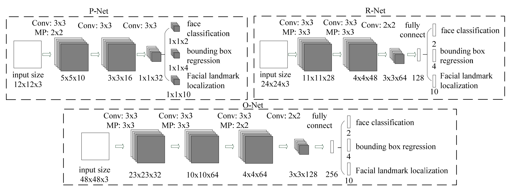

+++
# Project title.
title = "Определение пола и возраста по фото"
subtitle = "Проект был выполнен для компании Deep.Social"
# Date this page was created.
date = 2018-08-27T00:00:00

# Project summary to display on homepage.
summary = "Принципы работы модели, архитектура, подготовка данных, обучение. Результаты работы модели превосходят результаты всех коммерческих поставщиков аналогичной услуги по состоянию на июль 2018 года (Microsoft, Amazon, etc)"

# Tags: can be used for filtering projects.
# Example: `tags = ["machine-learning", "deep-learning"]`
tags = ["Instagram", "Deep.Social"]
math = true
# markup = "mmark"
bibrefs = "gender_age"

[header]
  image="/project/gender_age/montage.jpg"
  caption="Аватары пользователей Instagram"
# Featured image
# To use, add an image named `featured.jpg/png` to your project's folder. 
# [image]
#  # Caption (optional)
#  caption = "Photo by rawpixel on Unsplash"
#  
#  # Focal point (optional)
#  # Options: Smart, Center, TopLeft, Top, TopRight, Left, Right, BottomLeft, Bottom, BottomRight
#  focal_point = "Top"

  
+++
## Введение
Для рекламодателей, использующих influencer marketing, важно понимать,
у какого блогера аудитория наиболее соответствует рекламируемым товарам и услугам.
Довольно бессмысленно рекламировать деловые костюмы девочкам-подросткам, так же как и 
продвигать женскую косметику среди аудитории мужчин за 30.

Но сам Instagram не предоставляет никакой соцдем информации по аудитории блогера, 
поэтому рекламодателям приходится работать с блогерами исключительно на основе своих 
предположений о составе их аудитории. Единственный способ подтвердить эти
предположения -- просмотреть выборку из фолловеров интересующего блогера и оценить на глаз их возраст и пол.
Это долгая, неинтересная, и немасштабируемая работа, к тому же не совсем 
объективная, т.к. разные люди оценят возраст по разному.
 
Но почему бы не поручить эту работу машине? Современные технологии Computer Vision
уже достаточно развиты, чтобы справиться с этой задачей без участия человека.

## Постановка задачи
На входе есть аватары Instagram пользователей. Необходимо понять, есть ли на аватаре
люди, и сколько их. Если изображён один человек, предсказать его возраст и пол. При этом
масштаб изображения может быть разным: на аватаре может быть портрет или даже часть лица, может быть
человек в полный рост, может быть что-то промежуточное.
Фото может быть цветным, чёрно-белым, тонированным,
пропущенным через искажающие фильтры, с дорисованными частями и т.п. 

Естественным образом задача разделяется на две основные части:

1. Обнаружение на фотографии людей
2. Определение пола и возраста.

## Обнаружение людей
Пол и возраст определяется прежде всего по лицу, поэтому обнаружением
человека считается наличие лица в кадре. Нога, рука или спина, хотя 
и говорят о наличии человека на фото, для решаемой задачи не подходят. 
Безусловно, можно обучить computer vision модель, которая будет отличать мужскую ногу от женской,
но на покрытие всех таких ситуаций ушло бы слишком много ресурсов, 
при сравнительно небольшой отдаче -- всё таки лица изображены на аватарах гораздо чаще, чем ноги.

Обнаружение лиц на фото это известная и хорошо проработанная задача computer vision,
поэтому здесь работа свелась к поиску подходящей модели и адаптации её
под требования проекта. Основными требованиями были приемлемая скорость работы
 (аудитория блогеров это сотни миллионов пользователей) и наличие уже 
 обученного и готового к использованию варианта (чтобы не тратить время
 на разметку данных и обучение). 

Одним из дополнительных пожеланий было совмещение моделью 
двух функций: собственно нахождения лиц на фото, и определения опорных
точек (face landmarks). Опорные точки это обычно центры глаз, кончик носа,
углы губ и другие топологические точки, положение которых на лице может быть 
однозначно определено. Зачем они нужны?

[Свёрточные сети](https://ru.wikipedia.org/wiki/%D0%A1%D0%B2%D1%91%D1%80%D1%82%D0%BE%D1%87%D0%BD%D0%B0%D1%8F_%D0%BD%D0%B5%D0%B9%D1%80%D0%BE%D0%BD%D0%BD%D0%B0%D1%8F_%D1%81%D0%B5%D1%82%D1%8C)
 (convolutional networks), используемые в моделях
компьютерного зрения, обладают свойством трансляционной инвариантности (translational invariance),
но не обладают (или обладают в ограниченном объеме) свойствами масштабной инвариантности (scale invariance)
и инвариантности к повороту (rotation invariance). Это означает, что если изображение
одного и того же лица смещается на фото в разные положения, то с точки зрения нейросети
это будет то же самое лицо (трансляционная инвариантность). Но если лицо поворачивается
или изменяется его масштаб, для нейросети это будут разные лица. Поэтому, чтобы
облегчить задачу для нейросети, лучше приводить все лица к единому масштабу и
единому вертикальному положению, а для этого нужна привязка к надёжным опорным точкам (например,
считать стандартным размером лица расстояние в 100 пикселей между горизонталью глаз и горизонталью губ,
и приводить все лица к этому масштабу)
 

С учетом перечисленных требований, задача свелась к выбору из двух моделей: MTCNN
 и детектора из библиотеки [dlib](http://dlib.net/):
  [CNN Face detector](http://blog.dlib.net/2016/10/easily-create-high-quality-object.html) + 
[5-point landmark detector](http://blog.dlib.net/2017/09/fast-multiclass-object-detection-in.html).

## MTCNN vs dlib
Обе модели продемонстрировали одинаково высокое качество обнаружения лиц,
ошибаясь крайне редко. С определением опорных точек ошибок больше, 
особенно на лицах, сильно наклонённых, или повёрнутых ближе к положению "профиль", чем к положению "анфас".
Но и здесь нет явного лидера. MTCNN более корректно определяет границы лица (bounding box),
 лучше распараллеливает обработку, плюс имеет хороший запас в коде для будущего ускорения, поэтому
для дальнейшей работы была выбрана именно эта библиотека.
Рассматривалась также библиотека [face_alignment](https://github.com/1adrianb/face-alignment), она даёт
даже избыточное дял данной задачи качество, но при этом медленно работает, и требует готовых bounding boxes. 

 

 

### Архитектура MTCNN

MTCNN состоит из трех CNN-"стадий" P-Net, R-Net и O-Net, каждая из которых
уточняет результаты предыдущей ступени, и предварительной стадии построения
"пирамиды изображений". Пирамида представляет из себя просто набор уменьшенных копий
входного изображения. MTCNN заранее не знает, в каком масштабе будут лица
на фото, а свёрточные сети, как уже говорилось выше, не инвариантны 
к масштабированию. Поэтому приходится готовить несколько
версий входного изображения в разных масштабах, и искать лица на каждой версии.

Задача стадий - определить границы (bounding box) всех лиц на изображении.
Первая стадий имеет самую простую архитектуру и работает очень быстро,
но при этом генерирует много ошибок первого рода (false positives). Задача
следующих стадий, более сложных и мощных -- выбрать из предложенных
bounding boxes наиболее похожие на правду, уточнить их координаты, и передать дальше.
Последняя ступень также определяет координаты опорных точек внутри 
результирующих bounding boxes. В конце каждой стадии сильно пересекающиеся друг с другом bounding boxes
сливаются в один bounding box с помощью алгоритма NMS (non-max suppression):

 

Трёхстадийная архитектура позволяет MTCNN работать быстро, т.к.
всю черновую работу делает простая первая ступень, а следующие занимаются
только уточнением результатов. Как показали замеры, основное время уходит на построение
пирамиды изображений, а не на собственно работу свёрточных сетей. 
Переход на более быстрые алгоритмы уменьшения изображений позволяет 
ещё в разы поднять производительность.

### Нормализация лиц
Перед тем, как отдавать найденные лица в детектор пола/возраста, их необходимо
*нормализовать*, т.е. привести лица разного масштаба, по разному повёрнутые и наклонённые,
к одному стандартному виду "как на паспорт".

Существует довольно много методик нормализации, от продвинутых, натягивающих
лицо как скин на 3D модель и манипулирующих этой моделью в пространстве, 
чтобы она смотрела прямо в объектив и заполняла весь кадр, находясь в его центре, до простых, ограничивающихся приведением лиц
к близкому масштабу. Какую из них выбрать?    

Я исходил из принципа минимального вмешательства: нормализация должна выдавать
только естественную форму лица, которая встречается в природе. Если нормализация
изменяет пропорции раздельно по осям X и Y, изменяет параллельность линий,
или тем более натягивает лицо на 3D сетку, то она может принести больше
вреда, чем пользы. Это подтверждают исследования
результатами которых я активно пользовался при работе над этим проектом.

Принципу сохранения естественных пропорций лица соответствует
 [преобразование подобия](https://ru.wikipedia.org/wiki/%D0%9F%D0%BE%D0%B4%D0%BE%D0%B1%D0%B8%D0%B5) (similarity transform) ,
т.е. набор действий ограничивается сочетанием сдвига, вращения и масштабирования. Это 
преобразование является частным случаем аффинного преобразования и описывается
c помощью следующей [матрицы перехода](https://en.wikipedia.org/wiki/Transformation_matrix) : 
  $$ \mathbf{A} = 
   \begin{bmatrix}
    a\_0 & b\_0 & a\_1 \\\\\\
    b\_0 & a\_0 & b\_1 \\\\\\
    0  & 0  & 1
   \end{bmatrix} $$
   
$$\begin{bmatrix}x'\\\\y'\\\\1\end{bmatrix}=\mathbf{A}\begin{bmatrix}x\\\\y\\\\1\end{bmatrix}$$

или в скалярной форме:
 $$ x' = a_0x - b_0y + a_1 = sx\cos(\theta) - sy\sin(\theta) + a_1 $$
 $$ y' = b_0x + a_0y + b1 = sx\sin(\theta) + sy\cos(\theta) + b_1 $$
 
где $(x,y)$ и ($x',y')$ -- координаты исходной и результирующей точек изображения,
$\theta$ -- угол поворота, $s$ -- коэффициент масштабирования.
   
Чтобы найти коэффициенты для матрицы перехода, используются опорные точки.
Есть координаты пяти опорных точек  $(\mathbf{s}_1 \dots \mathbf{s}_5),\\: \mathbf{s}_i = \[x_i, y_i, 1\]^\top$ "эталонного лица",
 имеющего правильный масштаб,
вертикальную ориентацию и расположенного в центре кадра. И есть координаты 
опорных точек на фото $(\mathbf{a_1} \dots \mathbf{a_5})$, которые нашёл MTCNN. Задача -- найти такие коэффициенты
 для $\mathbf{A}$, чтобы после преобразования точки c фото
по возможности совпали с эталонными точками, т.е. минимизировать
расстояние между эталоном и преобразованными точками с фото:
  $$\operatorname*{arg\,min}\_\mathbf{A} \frac{1}{n}\sum\_{i=1}^n \\|\mathbf{s}_i - \mathbf{Aa}_i\\|$$
Эта задача решается с помощью метода Umeyama



## Определение пола и возраста
### Выбор модели
Модель для определения пола и возраста подбиралась из примерно тех же критериев,
что и модель для обнаружения лиц:

1. Приемлемая скорость работы (и для обучения, и для предсказаний).
2. Наличие pretrained модели, чтобы не обучать всё с нуля.

Рассматривались три архитектуры: ResNet, NASNet, MobileNet.
За baseline был взят хорошо известный ResNet-50.

NASNet-A-Mobile-224, сконструированный с помощью "искусственного интеллекта", содержит примерно в 5 раз параметров, 
чем ResNet-50. Но на практике он обучался не в 5 раз быстрее, а даже медленнее, чем ResNet-50.

Аналогично mobilenet-1.0-224, несмотря на то, что содержит в разы меньше параметров,
чем ResNet-50, на практике обучался со скоростью, сопоставимой с ResNet-50,
показывая при этом худшие результаты предсказаний. Видимо, эта архитектура имеет смысл
именно для мобильных устройств, а не для стационарных GPU.

В итоге победил ResNet-50, как архитектура, оптимальным образом использующая
стационарный GPU (обучение шло на видеокартах GTX 1080TI).

### Архитектура
На выходе надо получить два предсказания, пол и возраст.
Можно обучить две отдельных модели, но эффективнее использовать [multitask 
learning](https://en.wikipedia.org/wiki/Multi-task_learning) и получить одну модель, выдающую одновременно два прогноза. 
Тем более пол и возраст с точки зрения здравого смысла не являются независимыми переменными, женщины и мужчины
взрослеют и стареют по разному:
$$P\_{gender}(D) \neq P\_{gender}(D|age)$$
$$P\_{age}(D) \neq P\_{age}(D|gender)$$
таким образом знание моделью пола будет помогать предсказывать возраст и наоборот.

Предсказание возраста это регрессия, для регрессионных задач в качестве целевой функции
обычно используют MSE (среднеквадратичную ошибку от предсказываемой переменной). Но в данном случае прямое применение
MSE не оправдано. Во-первых возраст не может быть отрицательным. Во-вторых, MSE предполагает линейную шкалу.
В реальности разница в 5 лет между
2-x и 7-летними детьми это гораздо больше, чем разница в 5 лет между 60-летним и 65-летним человеком,
т.е. человеческий возраст имеет скорее логарифмическую шкалу. Поэтому на входе 
в модель возраст трансформировался из исходного возраста $age$:
$$a=\log(age + \gamma)$$
где $\gamma$ это эмпирическая сглаживающая константа, чтобы разница между
новорожденным и взрослым не устремилась в бесконечность. Модель внутри себя
везде использует логарифмический возраст $a$, при выдаче результатов пользователю
он переводится обратно в линейную шкалу: 
$$\widehat{age}=\exp(\hat{a}) - \gamma$$ 

Так как определение возраста по фото это сложная задача, с которой даже люди
далеко не всегда справляются, хотелось получить на выходе также оценку неопределённости
(uncertainty estimation). Для этого можно предсказывать не точечную
 оценку возраста, а распределение вероятностей, каким он мог бы быть. Для простоты было принято, что ошибка определения
возраста имеет Гауссовское распределение, т.е.
$$\hat{a} \sim \mathcal{N}(a, \sigma^2)$$
где $\hat{a}$ это предсказанный возраст, $a$ - истинный возраст,
$\sigma^2$ -- дисперсия, отражающая степень неуверенности в прогнозе.
 
Тогда за целевую функцию можно принять то, насколько хорошо предсказанное распределение
соответствует истинному возрасту, т.е. функцию правдоподобия (likelihood):
$$\mathcal{L}(\hat{a}, \hat{\sigma} | a) = \prod_{i=1}^{n}\frac{1}{\hat{\sigma}\_i\sqrt{2\pi}}\exp\left(-\frac{(a_i-\hat{a}\_i)^2}{2\hat{\sigma}\_i^2}\right)$$
Использование произведения по всем примерам из батча может привести к проблемам с точностью вычислений с плавающей точкой,
поэтому на практике используют негативную логарифмическую функцию правдоподобия (negative log-likelihood):
$$\ell=\log(\mathcal{L})=-\frac{n}{2}\log(2\pi)-\sum\_{i=1}^{n}\log\hat{\sigma}\_i-\sum\_{i=1}^{n}\frac{(a_i-\hat{a}\_i)^2}{2\hat{\sigma}\_i^2}$$
$$L\_{age} = -\ell$$

Определение пола является бинарной классификацией, в качестве целевой функции в модели используется
стандартная для таких задач перекрестная энтропия:
$$L\_{gender} = -{(y\log(p) + (1 - y)\log(1 - p))}$$
где $y$ это бинарная метка класса, например 1 соответствует мужчине, 0 женщине,
а $p$ это предсказанная вероятность принадлежать классу с меткой 1, в данном случае
вероятность быть мужчиной.     

Результирующая целевая функция является просто суммой функций по полу и по возрасту:
$$L=L\_{age} + kL\_{gender}$$
Абсолютные значения целевых функций находятся в разных шкалах, например
значение $L_{age}$ зависит от того, в каких единицах измеряется возраст.
Чтобы привести их к более-менее одному масштабу, нужен выравнивающий коэффициент
$k$, значение которого подбирается эмпирически.
 
## Обучающая выборка
В идеале обучающая выборка должна быть из того же распределения,
что и данные, на которых потом модель будет делать предсказания.
Это означает ручную разметку фотографий из Instagram, т.к. достоверную информацию
о возрасте владельцев аккаунтов взять негде. 

Ручная разметка пола это в принципе посильная задача, а вот с возрастом
всё не так просто. Люди определяют возраст на глаз крайне субъективно, 
это означает большую дисперсию и затруднительность контроля результатов.
Для того, чтобы получить от работников надёжный результат, обычно одна и та же 
задача даётся трём-пяти людям, и за верный результат принимается большинство голосов.
Работник, часто дающий ошибочные результаты, заменяется. Для возраста
такая схема работать не будет, т.к. чтобы получить надёжную картину
максимума распределения возрастов для каждого фото и отсеять выбросы,
пришлось бы давать оценить каждое фото 10-20 людям, что было бы слишком затратно.



Оценка возраста людьми может сильно расходиться с реальным возрастом, 
см. приведённый рисунок. Кроме того, оценка возраста зависит еще и от национальности и культурного контекста
оценщика, т.е. пришлось бы набирать распределённую по разным точкам мира команду.
 
Поэтому были рассмотрены другие источники. Стандартный dataset,
 используемый в академических кругах для подобных задач, это [IMDB-WIKI](https://data.vision.ee.ethz.ch/cvl/rrothe/imdb-wiki/)
 
Однако, качество разметки этого dataset-а, особенно в данных из IMDB, крайне низкое,
и неприемлемо для проекта, который будет использоваться в production.

Остальные доступные datasets: ([Adience](https://talhassner.github.io/home/projects/Adience/Adience-data.html),
 [UTKFace](https://susanqq.github.io/UTKFace/)) слишком малы для полноценного обучения.
 
В результате самым продуктивным оказался самостоятельный автоматизированный сбор данных
из социальных сетей и Интернет-сайтов, с последующей модерацией.
Но найти хорошие источники размеченных фотографий для возрастов <17 так и не удалось,
поэтому для этой возрастной категории были выкачаны фото из Инстаграм,
содержащие тэги, указывающие на возраст (обычно такие тэги бывают в фото с дней рождения).
Пол в этих фото размечался вручную, релевантность содержимого фото (что на ней изображены именно дети) 
и разметки возраста (возраст с тэга совпадает с визуальным возрастом) контролировались командой модераторов.

Работа по получению и разметке обучающих данных была самым долгим этапом проекта
и заняла около 4-х месяцев.

## Подготовка данных
В обучающей выборке выравнивалось количество мужчин и женщин
из каждой страны (например в арабских странах и в Индии женщины представлены в онлайне слабо,
и без выравнивания модель могла просто не научиться с ними работать).

Распределение количества
фото по странам по возможности приводилось в соответствие с распределением
кол-ва аккаунтов по странам в Instagram. При этом странам с преобладающим азиатским или негроидным населением
давался больший вес, чтобы в обучающей выборке не доминировала европеоидная раса
и у модели было достаточно данных, чтобы научиться работать с азиатскими
и негроидными типами лиц.

Также убирались перекосы по возрастам, чтобы распределение возрастов
было похожим на распределение, заявленное для Instagram в открытых источниках.

В итоговую выборку попало около 3 млн. фото взрослых и около 300 тыс.
фото детей и подростков.

### Аугментация данных
[Аугментация](https://blog.algorithmia.com/introduction-to-dataset-augmentation-and-expansion/)
проводилась по тому же принципу, что и нормализация лиц:
на выходе должны получаться только такие фото, которые могут встретиться
в естественных условиях. Зашумленных, нерезких, тонированных и частично обрезанных
фото было и так достаточно в обучающих данных, при этом качество фото
на аватарах в Instagram в среднем достаточно высокое. Поэтому разновидности
аугментации, "ухудшающие" фото, не применялись.

Аугментация свелась к вертикальному зеркалированию (flip), случайному повороту на небольшой угол 
и случайному кропу. MTCNN не абсолютно точно и одинаково определяет опорные
 точки на всех фото, от лица к лицу возможны вариации,
два последних вида аугментации как раз учат нейросеть справляться с такими отклонениями. 
  
## Обучение
Использовалась модель ResNet-50, предварительно обученная на данных Imagenet.
У неё убирался последний слой, отвечающий за классификацию ImageNet,
и вместо него добавлялся полносвязный (fully connected, FC) слой, генерирующий предсказания для модели
(3 выходных значения: пол, матожидание и дисперсия возраста).

Обучение проводилось в два этапа, сначала обучался только добавленный
FC слой, затем, когда ошибка переставала уменьшаться, в обучение включалась
вся модель. Transfer learning, т.е. обучение только последнего слоя,
сам по себе давал посредственные результаты: точность определения пола
была не выше 85%. Это объяснимо, т.к. человеческие лица представляют собой
довольно узкий и специфический домен, сильно отличающийся от данных ImageNet, к тому же в ImageNet
не существует классов "человек" или "лицо".

Использовался оптимизатор Nesterov Momentum и cosine learning rate decay с рестартами 
Максимальный и минимальный learning rate подбирался с помощью техники *LR range test*  



Один полный прогон обучения занимал около пяти дней.

## Результаты
Результаты работы обученной модели сравнивались с результатами 4-х крупных коммерческих
систем Computer Vision: [AWS Rekognition](https://aws.amazon.com/rekognition/),
 [Microsoft Azure](https://azure.microsoft.com/services/cognitive-services/face/), [Face++](https://www.faceplusplus.com/attributes/),
  [Clarifai](https://clarifai.com/models/demographics-image-recognition-model-c0c0ac362b03416da06ab3fa36fb58e3).
Чтобы сравнение было объективным, замеры проводились не только на собственной
тестовой выборке, но и на дополнительных datasets: [Adience](https://talhassner.github.io/home/projects/Adience/Adience-data.html)
 и [IMDB-WIKI](https://data.vision.ee.ethz.ch/cvl/rrothe/imdb-wiki/).

Для возраста точность оценивалась по ошибке MAPE (Mean absolute percentage error),
показывающей отклонение в процентах определенного моделью возраста от реального.

$$MAPE=\frac{100\%}{n}\sum\_{i=1}^{n}\left|\frac{age_i - \widehat{age}_i}{age_i}\right|$$

где $age$ -- истинный возраст, $\widehat{age}$ - предсказанный возраст

### Собственный dataset
Распределение возрастов соответствует естественному распределению в социальных сетях,
откуда были собраны данные.  

| Service         | Gender accuracy, % | Age MAPE, % |
| --------------- |:------------------:|:-----------:|
| __Ours__        |           __99.3__ |    __14.4__ |
| Face++          |             92.2   |      59.3   |
| Clarifai        |             84.8   |      47.7   |
| Azure           |             96.9   |      34.2   |
| AWS Rekognition |             91.1   |      38.1   |

### IMDB-Wiki
Из IMDB-WIKI были отброшены данные IMDB, как содержащие огромное количество 
неточностей, в данных WIKI был дополнительно вручную исправлен пол там, где
были явные ошибки.
Для тестов были взяты фото людей в диапазоне возрастов 13-44 года (актуальный диапазон для Instagram). 
Также были отброшены фотографии, сделанные до 2005 года, т.к. стилистика этих фото (косметика, причёски) отличается от современной,
и фото такой давности редко встречаются в соцсетях.

| Service         | Gender accuracy, % | Age MAPE, % |
| --------------- |:------------------:|:-----------:|
| __Ours__        |           __98.7__ |    __14.9__ |
| Face++          |             92.6   |      36.6   |
| Clarifai        |             91.9   |      35.9   |
| Azure           |             89.4   |      24.6   |
| AWS Rekognition |             94.0   |      43.8   |

### Adience
Возраст в Adience указан в виде диапазона а не точного значения, поэтому для него использовались
другие метрики точности:

* *Age accuracy* -- процент попаданий предсказанного возраста в правильный диапазон. 
* *Age accuracy one-off* -- процент попаданий или в правильный диапазон или в два соседних с ним.
 
| Service         | Gender accuracy, % | Age acc., % | Age acc. one-off, % |
| --------------- |:------------------:|:-----------:|:-------------------:|
| __Ours__        |           __97.7__ |      19.8   |   83.8              |  
| Face++          |             86.3   |      14.8   |   65.1              |
| Clarifai        |             84.6   |      25.7   |   78.4              |
| Azure           |             94.8   |    __36.9__ | __89.8__            |
| AWS Rekognition |             88.9   |      21.3   |   82.9              |

В этом тесте точность определения возраста у модели уступает некоторым коммерческим сервисам (на первом месте - Azure).
Объясняется это тем, что Adience это академический dataset, в котором все возраста от 0 до 80 лет присутствуют
в примерно равной пропорции. Модель же обучалась под распределение возрастов, 
наблюдающееся в реальной жизни в Instagram и социальных сетях, которое весьма далеко от равномерного (доминирует возраст 18-30).
Соответственно, на равномерном распределении точность модели хуже, т.к. при прочих равных предпочтение отдаётся возрастам в диапазоне 18-30.
 
Если бы целью было показать хороший результат именно на Adience, 
надо было бы обучить модель на выборке с равномерным сэмплированием по всем возрастам.
              
## На что смотрит модель? 
Было бы интересно понять, какие области лица играют главную роль при
определении пола/возраста. Большинство традиционных методы выявления областей 
внимания для этой модели, к сожалению, не выдают наглядных результатов, т.к.
в результате нормализации лицо занимает практически весь кадр, и вся его
площадь является активной областью. Самые наглядная визуализация получилась 
 при использовании библиотеки SHAP (метод DeepExplainer)
 
 Видно, что модель прежде всего обращает внимание на зоны, где возможна растительность
 на лице: область над губой, щёки. Для щек также вероятно важна структура кожи,
 более грубая у мужчин. Для женщин важны разрез глаз (и по видимому наличие там косметики)
 и форма подбородка. Для мужчин - форма и "кустистость" бровей.
 
 Из собственного практического опыта работы с этой моделью -- она смотрит примерно на те же
 признаки, что и человек, никакого сверхзнания у неё нет. Если показать
 модели фото мальчика, хорошо загримированного под девочку, модель выдаст
 ответ "девочка", и наоборот. Трансгендеры и лица, не до конца определившиеся
с выбором визуального пола, вызовут у модели затруднения при определении биологическго пола,
такие же, как и у людей.   
 
## Эволюция в результате обучения
Ещё один вопрос, на который было интересно ответить -- насколько
модель далеко ушла в своей эволюции от изначальной модели, обученной
на изображениях ImageNet? Поскольку выразить "далеко" или "не очень"
в виде числовой оценки затруднительно, лучше получить ответ в виде
визуализации. Я использовал визуализацию каналов ResNet с помощью
библиотеки [Lucid](https://github.com/tensorflow/lucid).
 Суть этой визуализации в том, что с помощью оптимизации подбирается такое входное изображение,
которое максимизирует ответ от канала. Содержимое этого изображения
будет указывать, на какие паттерны во входном изображении реагирует данный канал.

Если сравнить визуализации одних и тех же каналов в исходной сети
и в сети после обучения на лицах, будет видно, как поменялось "восприятие" сетью изображений.
Будем визуализировать избранные каналы в блоках ResNet от первых блоков,
самых примитивных, обрабатывающих контуры и границы
до последних, обрабатывающих целые визуальные объекты.
Верхний ряд каждой визуализции это каналы модели, обученной распознаванию пола и возраста,
нижний ряд - те же самые каналы исходной модели, обученной на ImageNet.
 
 
 
В первом блоке обрабатываются самые простые паттерны. Видно что паттерны
для исходной и нашей модели не сильно отличаются. Тем не менее уже заметно,
что паттерны для ImageNet (нижние ряды) имеют более сложную структуру.   

 
Во втором блоке паттерны усложнились, но всё еще похожи друг на друга. Заметно,
что в паттернах ImageNet больше цветовое разнообразие, а паттерны нашей
модели окрашены в цвета, близкие к телесным. 

 
 
В третьем блоке паттерны продолжают усложняться, и схожесть между ними остаётся только на самом общем уровне.
Паттерны ImageNet имеют гораздо более проработанную структуру, которая
начинает соответствовать объектам из реального мира.

 
 В последнем блоке паттерны окончательно перестали был похожими друг на друга.
 В паттернах нашей модели видна структура, соответствующая человеческим губам.
 в паттерах Imagenet -- что то растительное.

Видно, что эволюция в верхних слоях зашла довольно далеко,
при этом паттерны нашей модели в целом проще исходных, т.е. произошла некоторая 
деградация. Возможно, что ResNet-50 избыточен для данной задачи,
и можно было использовать более простую сеть.
 
# Интерактивное демо
В статье не публикуются образцы предсказаний модели, т.к. любые предсказания
можно сгенерировать самостоятельно, с помощью интерактивного
демо, находящегося по адресу https://ag-demo.suilin.ru/.  

В демо можно загружать любые фото, где есть лицо одного человека. Поддерживается
 работа как с компьютеров, так и со смартфонов (можно определять пол и возраст для селфи).

# Резюме
Задача распознавания пола и возраста в промышленных масштабах оказалась
вполне решаемой. При этом модель угадывает возраст примерно на уровне
человека, часто даже точнее. 

## Возможные улучшения
1. Сделать более выравненную по возрастам обучающую выборку, чтобы не страдало качество вне основного диапазона возрастов
2. Попробовать ускорить обучение с помощью *Super-Convergence* .
 Если ускорить обучение (рекорд скорости обучения ResNet-50 -- [18 минут](https://www.fast.ai/2018/08/10/fastai-diu-imagenet)), появится
возможность обучаться на большем количестве данных. В результате можно увеличить размер обучающей выборки и активнее использовать аугментацию,
например применить алгоритмы AutoAugment, Mixup.

3. Попробовать более современные, чем ResNet, архитектуры: AmoebaNet,
 DenseNet, WideResNet.
4. Работа с лицами это достаточно узкая и специфичная задача, возможно оптимальнее
будет не использовать архитектуру общего назначения, а создать custom архитектуру,
нацеленную именно на обработку лиц. Можно использовать методики 
автоматического создания и оптимизации архитектур: 
ENAS, DARTS, 
Auto-Keras,  AdaNet.

    

      
 
 

 

