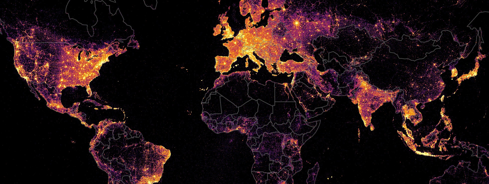
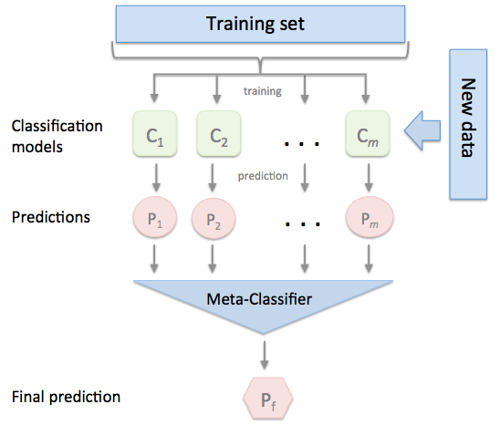
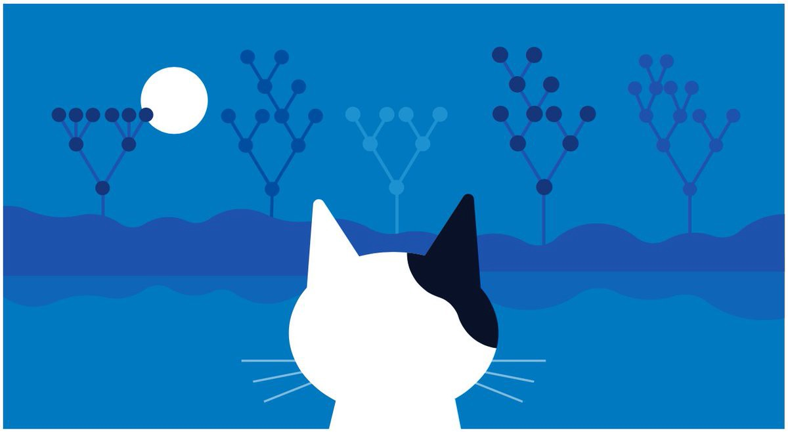
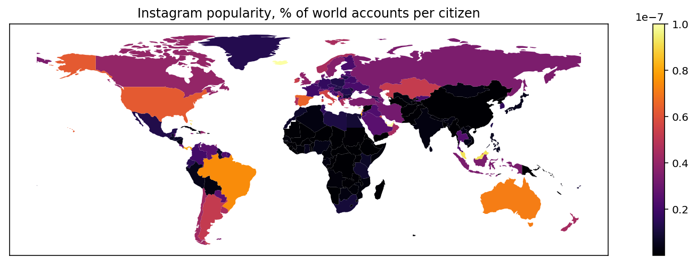

+++
# Project title.
title = "Определение места жительства Instagram пользователей"
subtitle = "Проект был выполнен для компании Deep.Social"
# Date this page was created.
date = 2018-06-27T00:00:00

# Project summary to display on homepage.
summary = "Решение проблемы определения места жительства владельца Instagram аккаунта с помощью моделей машинного обучения. Подготовка данных, архитектура моделей, методика обучения, результаты."

# Tags: can be used for filtering projects.
# Example: `tags = ["machine-learning", "deep-learning"]`
tags = ["Instagram", "Deep.Social"]

# [header]
#  image="project/geo/world_crop.jpg"
#  caption="Кол-во Instagram постов в каждой точке мира"
# Featured image
# To use, add an image named `featured.jpg/png` to your project's folder. 
# [image]
#  # Caption (optional)
#  caption = "Photo by rawpixel on Unsplash"
#  
#  # Focal point (optional)
#  # Options: Smart, Center, TopLeft, Top, TopRight, Left, Right, BottomLeft, Bottom, BottomRight
#  focal_point = "Top"
math = true
+++

Для рекламодателей одним из самых важных параметров блогера и его
аудитории является географическое положение (geolocation), соответствующее
месту жительства.
Чтобы рекламная кампания была эффективной, она обычно должна быть таргетирована
 на конкретную страну или даже город. 

## Геотэги
Посты в Instagram могут содержать информацию о месте, в котором был сделан пост, называемую *geotags*.
 Это самый простой и очевидный способ определения geolocation. В заголовке страницы приведена карта,
  окраска которой соответствует количеству постов, сделанных в каждой точке мира (построено
  по данным геотэгов из более чем 4 млрд. постов).
Видно, что наибольшая интенсивность
    постов соответствует местам с большой плотностью населения -- крупные города с пригородами, 
 зоны вдоль крупных трасс. 

Но геотэги, несмотря на свою очевидную полезность, не являются надёжным источником информации
 о месте __проживания__ владельца аккаунта:
 
* Часто люди используют geotagging только когда едут в командировку/отпуск/путешествие или находятся в интересных с их точки зрения местах.
 То есть у блогера, живущего в Лондоне, геотэги могут быть из каких угодно мест мира, кроме самого Лондона.
* Далеко не все аккаунты включают geotagging постов. У большинства постов (более 85%) геотэги не проставлены.
 
 Поэтому, если определять geolocation только по геотэгам, у результатов будет маленькое покрытие и низкая точность.
 Чтобы улучшить качество определения, необходимо использовать дополнительную информацию.
 

  
## Дополнительные источники информации
Cуществует много дополнительных, не столь очевидных и надёжных, как геотэги, источников информации о местоположении блогера.

* В первую очередь это текст из раздела ‘bio’ аккаунта: в нем могут быть указаны город блогера или локальные географические названия, 
сайт или email в национальных доменах, emoji, соответствующие флагам стран, и т.п. 
* Такая же информация + текстовые тэги может содержаться в тексте постов и комментариев.
* Кроме этого, можно использовать информацию о языке и audience geolocation -- очевидно, 
что например японская аудитория скорее будет у блогера из Японии, чем у блогера из Мексики.
Также маловероятно, что мексиканский блогер будет делать посты на японском языке.
* Также, приблизительную геоинформацию можно извлекать из фотографий в постах (когда нет геотэгов). 

Вся эта информация извлекается с помощью набора правил,
использующих как и сложные закодированные вручную эвристики, так и
 machine learning модели для named entity recognition.
Рассказ о методиках извлечения может потянуть
на отдельный проект, поэтому здесь я сфокусируюсь только 
 на использовании уже извлеченной геоинформации.

## Ensemble learning
Итак, есть несколько источников геоинформации.
Каждый отдельно взятый источник не очень точен и достоверен, 
но совместное их использование может дать намного более точный результат. Классический подход, 
используемый для работы с такими источниками, это *ensemble learning*.

> Ensemble learning is a machine learning paradigm where multiple learners 
> are trained to solve the same problem. In contrast to ordinary machine 
> learning approaches which try to learn _one_ hypothesis from training data,
>  ensemble methods try to construct a set of hypotheses and combine them to use.[^1]
 
В нашем конкретном случае используется разновидность ensemble learning, называемая 
*[stacking](https://en.wikipedia.org/wiki/Ensemble_learning#Stacking)*.

Смысл этого метода в том, что есть два уровня моделей:

* First level -- это модели, извлекающие геоинформацию из данных Instagram, о которых мы говорили 
в предыдущем разделе (*base classifiers*). 
* Second level (*meta-classifier*) использует предсказания, сгенерированные моделями на первом уровне,
 для принятия окончательного решения. 
 

## Weighted majority voting
Простейший способ создания meta classifier -- это использование *weighted majority voting*.
 Есть $N$ базовых классификаторов, каждому из них присваивается вес $w_i$, соответствующий 
 вероятности правильной классификации $\hat{p}_i$ (в данном случае правильному определению страны блогера).
 Вероятности рассчитываются по обучающей выборке.
$$w_i=\log\left(\frac{\hat{p}_i}{1−\hat{p}_i}\right),\quad i=1,\dotsc,N$$

Классификаторы, которые часто ошибаются, получают меньший вес, классификаторы, у которых высокая точность -- больший вес. 
На этом "обучение" заканчивается.

Использование: для интересующего нас аккаунта каждым из базовых классификаторов назначаются
 метки классов (в нашем случае это предполагаемые страны), получаем набор меток
 $l_1,\dotsc,l_N$ . Значения, которые могут принимать метки,
  это множество всех стран размером $M$: $(c_1,\dotsc,c_M)$. 
 Подсчитывается рейтинг каждого класса суммированием весов всех отданных
 за него голосов.  
     
  $$R(k)=\sum_{l_i=c_k}w_i,\quad k=1,\dotsc,M$$

Результирующий класс (страна) -- тот, который набрал наибольший рейтинг,
 т.е. тот за которого было отдано больше голосов с большим весом:
$$k^\*=\operatorname*{arg} \operatorname\*{max}_{k=1}^M R(k)$$

Первая модель для определения geolocation использовала именно этот способ,
 как самый простой в реализации. Но у него есть недостатки:
 
* Предсказания base classifiers могут быть неверными, например из bio может быть извлечена страна Япония, 
 из геотэгов -- Бразилия и Германия, при этом блогер на самом деле живет в Англии.
  Поэтому meta classifier должен не просто предсказывать страну, но еще
   и выдавать вероятность правильного ответа. Если полученная вероятность
    ниже некоторого порога, надо считать, что для определения страны у нас недостаточно информации.
  Но majority voting не выдает значение вероятности, 
  можно только примерно оценить верхнюю и нижнюю границы.
* Majority voting не умеет работать с дополнительной информацией, не являющейся 
меткой класса, например с языком аккаунта.
* Majority voting исходит из предположений, что предсказания base classifiers
не коррелируют друг с другом, и что вероятность 
корректной классификации одинакова для любой страны. В реальной жизни 
ни то ни другое не выполняется: надо учитывать и возможные взаимодействия
между классификаторами и индивидуальные особенности стран.

## Gradient boosting
Учитывая все недостатки majority voting, была разработана более совершенная модель,
 использующая *[градиентный бустинг](https://en.wikipedia.org/wiki/Gradient_boosting)*.
  В данном проекте использовалась
 библиотека [Yandex CatBoost](https://tech.yandex.ru/catboost/).

Градиентный бустинг это один из самых лучших известных на сегодняшний день алгоритмов машинного обучения
для табличных данных. Поэтому качество полученной модели превзошло все ожидания.

### Формирование обучающих данных
Чтобы обучить модель, надо сначала каким то образом получить разметку Instagram
аккаунтов в виде истинного места проживания владельца. Получить эти данные напрямую
от владельцев затруднительно, поэтому был использован косвенный источник: Twitter. 
 
Владелец Twitter аккаунта может указать свое место жительства (location), эта информация общедоступна. 
 Если у этого же человека есть Instagram account, то можно использовать геоинформацию из Twitter, 
 в качестве ground truth. Конечно геоданные из Twitter не являются абсолютно точными, т.к. люди не всегда 
 указывают настоящее место жительства, или переезжают и забывают обновить location.
 По приблизительным оценкам, примерно у 1-3% Twitter аккаунтов информация
о location является неверной или устаревшей. Но, как показала практика, это не помешало обучению.

Место жительства из Твиттера представляет собой строку произвольного формата. Иногда там указана
страна, иногда город, иногда штат, иногда просто афоризм или шутка, не имеющие отношения к географии.
Для обучения необходимо преобразовать эти данные к коду страны.
Задача получения географических координат из адреса произвольного формата называется
 *[геокодирование](https://en.wikipedia.org/wiki/Geocoding)*. В этом проекте для геокодирования была использована
 система [Nominatim](https://wiki.openstreetmap.org/wiki/Nominatim), созданная сообществом Open Street Maps.
 
 Задача геокодирования часто не имеет однозначного решения. Например, строка Moscow может обозначать столицу России,
 а может город в USA. Georgia может оказаться как страной Грузией, так и штатом в USA.
 
Чтобы убрать неоднозначности и повысить точность, дополнительно использовался анализ поисковой выдачи Google.
В выдаче по строке с адресом проверялось наличие сниппета "географическое место", и если сниппет найден,
в нём анализировалась ссылка на информацию в [WikiData](https://www.wikidata.org).
Если страна из WikiData совпадала со страной, которую
выдал Nominatim, результат геокодирования принимался, в противном случае назначалась дополнительная ручная
проверка. Идея здесь в том, что Google, на основе собственного анализа популярности поисковых запросов,
знает, какой город люди обычно имеют в виду, когда пишут "Moscow". Как показали результаты, такая перепроверка
оказалась полезной, и значительно повысила точность геокодирования по сравнению с использованием чистого Nominatim.

### Модель
Самый очевидный способ моделирования это multiclass classification, где каждый класс
соответствует отдельной стране. Но такая модель не очень хорошо работает на практике.
Проблема в том, что распределение стран по количеству аккаунтов в них
очень неравномерное. Есть несколько доминирующих стран, в которых находится
основное количество аккаунтов, и длинный хвост из стран небольшого размера,
или в которых Instagram непопулярен. В результате для стран из "хвоста"
качество определения страны будет посредственным. Модели просто не хватит
данных для обучения в этих странах.



На рис. 1 видно, что с уменьшением количества аккаунтов на страну точность понижается. 
Чтобы избежать этого эффекта, был выбран другой способ моделирования классов,
близкий по смыслу к majority voting, где модель вообще не отличает страны друг от друга,
а принимает во внимание только "силу" голосов за каждую страну.

В данных каждого аккаунта базовые классификаторы обычно распознают не более
3-4 разных стран. Из этих стран и надо выбрать правильный ответ (или отсутствие ответа).
Поэтому для работы модели достаточно всего 4-x классов, каждый из которых
соответствует одной уникальной стране во входных данных, плюс один негативный класс
"Другое", чтобы модель могла просигнализировать, что ни одна страна из предложенных не подходит.
Страны ранжируются в порядке популярности, т.е. самая часто встречающаяся
страна из предложенных принимается за класс №1, вторая по популярности за класс №2 и т.п.
В то же время, чтобы учесть индивидуальные особенности отдельных стран,
идентификаторы предложенных стран (country codes) тоже подаются на вход модели. 

Таким образом модель совмещает в себе лучшее и от majority voting (способность
обучаться на любых странах, даже если эта страна встретилась в обучающей выборке всего единожды)
и от multiclass c классами-странами (способность учитывать особенности
отдельной страны). Эксперименты показали, что точность такой модели для
мелких стран заметно выросла, без ухудшения точности для крупных.
 
 
### Результаты обучения
Была получена точность определения страны **97%** при покрытии **86%** (т.е. для 14% аккаунтов имеющейся информации
оказалось недостаточно для надежного принятия решения и выданная вероятность была ниже заданного порога).
Если вообще не использовать пороговую вероятность, и учитывать предсказания для любых аккаунтов,
   где есть хотя бы какая нибудь геоинформация, получится точность 93.4%.
 Цифры точности измерялись на тестовой выборке, т.е. на аккаунтах, которые модель ни разу не видела в процессе
 обучения и настройки гиперпараметров.





Как видно из рис. 3, наиболее важны country_id (идентификатор страны, позволяет модели
 учитывать индивидуальные особенности отдельных стран), геотэги из постов, язык блогера
и геоданные аудитории. Но эта диаграмма не совсем корректно отражает реальную важность,
потому что далеко не все features присутствуют в каждом аккаунте.



Если нормализовать важность features по частоте их появления в аккаунтах,
то будут лидировать features c самой точной геоинформацией:
телефонные номера (код страны), geotags, emoji (флаги стран).

Можно заглянуть еще глубже, и проанализировать модель с использованием [SHAP framework](https://github.com/slundberg/shap)[^2].


Чем дальше точки на рис. 5 отклонены от середины, тем больше влияет
на результат данная фича. Голубые точки это нулевые значения, обычно
соответствующие отсутствию feature во входных данных, красные -- ненулевые,
т.е. в данном контексте непустые.



На рис. 6 также видно, что наиболее “активными” features являются country_id, геотэги из постов, язык и emoji.

## Образец работы модели
Чтобы можно было посмотреть на реальные результаты работы модели, сформирована
демо-выборка из 2000 аккаунтов (по тестовым данным, которые модель не
 видела в процессе обучения). Выборка представляет собой CSV файл, состоящий из 5 колонок:
 
* **instagram** -- Instagram аккаунт, для которого определялась страна
* **twitter** -- соответствующий Twitter account, источник "правды"
* **prediction** -- предсказанная страна
* **truth** -- страна из Twitter
* **probability** -- вероятность, интерпретируемая как уверенность в предсказании

Файл можно загрузить [здесь](geo_sample.csv.gz).

В выборку включены результаты, где вероятность > 90%. Как видно по приведенным данным,
качество связки Instagram <--> Twitter не идеальное, попадаются ошибки,
которые ухудшают замеренную результирующую точность. Поэтому реальная
точность модели возможно еще выше, чем замеренные 97%

## Визуализации геоданных 
В завершение -- пара дополнительных визуализаций географических данных Instagram,
полученных с помощью описанной выше модели.

### Визуализация 1
Подсчитаем распределение количества аккаунтов Instagram по странам мира.
Абсолютное количество, конечно, невозможно подсчитать, потому что для этого нужны были бы данные по всем аккаунтам,
 существующим в Instagram. Вместо этого можно взять достаточно большой сэмпл и посчитать,
  какой процент от всех аккаунтов принадлежит каждой стране.
  


### Визуализация 2
Предыдущая визуализация интересна, но очевидно, что чем больше население страны, 
тем больше в ней будет Instagram accounts. Чтобы убрать зависимость от населенности,
можно подсчитать, какой процент от общего количества Instagram аккаунтов 
 приходится _на одного жителя_ страны. Таким образом мы получим популярность Instagram среди населения.

Видна совершенно другая картина.
Пятерка стран, где жители больше всего любят Instagram: *Cyprus, United Arab Emirates,
 Iceland, Qatar, Malaysia*. Эти страны окрашены светло-желтым, поэтому их не очень хорошо заметно на карте.
 Среди крупных стран Instagram более всего популярен в *Brazil, Australia, USA*.
Менее всего Instagram популярен в Африке и Азии.

## Заключение
Проект передан в production, и успешно использовался 
в компании Deep.Social, радикально улучшив качество определения места жительства
блогеров и их аудиторий, и убрав больше количество претензий клиентов к неточным данным.
В настоящий момент проект также используется в компаниях, купивших у Deep.Social права на
её продукт.

#### Возможные улучшения:
1. Сейчас учитываемые геотэги просто суммируются, порядок их следования никак не учитывается
 (bag of geotags). В то же время, в геотэгах часто прослеживается явная темпоральная структура, соответствующая
 географическим перемещениям владельца аккаунта. Если учитывать эту структуру, 
 то есть работать с геотэгами, как с временным рядом, возможно будет 
 повысить точность. Например модель сможет различать ситуации, когда
 владелец аккаунта поехал в командировку и когда он переехал на новое место жительства.
2. Информация из фотографий сейчас не используется, т.к. обучение computer vision
классификатора занимает много времени, и проект не уложился бы в плановые сроки.
Если начать использовать эту информацию, будет дополнительный источник
данных, особенно актуальный для аккаунтов, которые не используют геотэги и не указывают
дополнительной информации в bio. Вырастет покрытие.

[^1]: [Zhi-Hua Zhou, Ensemble Learning](https://cs.nju.edu.cn/zhouzh/zhouzh.files/publication/springerEBR09.pdf). 
[^2]: Scott Lundberg, Su-In Lee (2017). A Unified Approach to Interpreting Model Predictions. [arXiv:1705.07874](https://arxiv.org/abs/1705.07874) \[cs.AI\]
