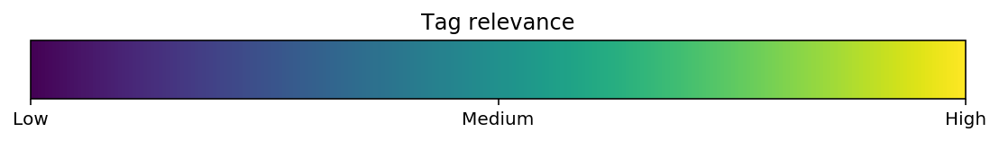

+++
# Project title.
title = "TopicTensor: тематики в Instagram"
subtitle = "Проект был выполнен для компании Deep.Social"
# Date this page was created.
date = 2018-06-27T00:00:00

# Project summary to display on homepage.
summary = "Создание embeddings для формирования и определения тематик Instagram постов и тематик блогеров. Подбор блогеров по тематикам, тематические lookalikes и другие применения."

# Tags: can be used for filtering projects.
# Example: `tags = ["machine-learning", "deep-learning"]`
tags = ["Instagram", "Deep.Social"]

[header]
  image="/project/topic_tensor/incredible.png"
  caption="Тематика, сформированная по тэгу #incredible"
# Featured image
# To use, add an image named `featured.jpg/png` to your project's folder. 
# [image]
#  # Caption (optional)
#  caption = "Photo by rawpixel on Unsplash"
#  
#  # Focal point (optional)
#  # Options: Smart, Center, TopLeft, Top, TopRight, Left, Right, BottomLeft, Bottom, BottomRight
#  focal_point = "Top"
math = true
draft = false
+++
## Проблема подбора блогеров
У рекламодателей, использующих продвижение товаров и услуг через посты инфлюэнсеров, есть большая проблема,
 которая называется таргетирование. Если рекламодатель даёт рекламу, например,
 через AdWords, он может сфокусироваться по ключевым словам на сколь угодно узкий тематический сегмент аудитории,
  точно соответствующий тем товарам и услугами, которые он продвигает на рынок.
 В социальных сетях такой возможности нет: в Instagram миллионы потенциальных инфлюэнсеров,
  у которых можно разместить рекламу. Каким образом выбрать из них тех, тематика которых подходит рекламодателю? 
Или рекламодатель должен сам активно пользоваться Инстаграмом и априори знать тех блогеров,
которые ему подойдут (т.е. только крупных и только тех, на кого он сам подписан).
Или просто давать рекламу наугад, надеясь что она дойдет до хотя бы небольшого процента целевой аудитории.
Понятно, что оба варианта не очень хороши, поэтому для нишевых средних и мелких рекламодателей Инстаграм малоэффективен.

Если решить эту проблему, реклама в Инстаграме доступной и удобной для всех, а не только для крупных брендов. 

## Тематический рубрикатор? Спасибо, не надо.
Самый очевидный путь разделения блоггеров на тематические сегменты -
 это тематический рубрикатор. Для этого сначала вручную создаётся дерево тематик.
 Затем каждый блогер вручную или с помощью машинного обучения соотносится с рубриками этого дерева.  
  
 Этим путём идёт большинство рекламных систем, включая такие крупные, как Facebook Ads.
  Но на самом деле это неэффективное решение.
   Количество потенциально интересных рекламодателям тематик очень велико.
 Не будет ошибкой сказать, что оно потенциально бесконечно - чем более в узкой нише работает рекламодатель,
  тем более мелкое дробление на тематики ему требуется.
  
* Например, есть тематика __Еда__. 
* Очевидно, что ресторану нужна не просто __Еда__, а __Еда : Рестораны__. 
* Если это ресторан тайской кухни, то нужна еще более узкая тематика __Еда : Рестораны : Тайская кухня__. 
* Если этот ресторан находится в Лондоне, неплохо было бы добавить и тематику __Еда : Рестораны : Лондон__, и так далее.
 
Но дерево тематик не может расти бесконечно:

1. C ним станет банально неудобно работать рекламодателю.
 Размер рубрикатора, который без усилий может воспринять и удержать в голове обычный человек - не больше 100 пунктов. 
2. Чем больше рубрик, тем сложнее отнести блогера к конкретным рубрикам и тем больший объем работы для этого нужен.
 Сделать эту работу вручную (блогеров - несколько миллионов) вообще невозможно. 
 Можно использовать машинное обучение, но всё равно сначала надо составить обучающую выборку,
  т.е. образцы правильной разметки блогеров тематиками. Её составляют люди, люди делают ошибки,
   люди субъективны в своих взглядах и оценках (разные асессоры отнесут одного и того же блогера к разным рубрикам).
  Если учесть, что многие блогеры работают одновременно в нескольких тематиках, проблема еще больше усложняется.
3. Придётся тратить много усилий на поддержание рубрикатора в актуальном состоянии 
(постоянно появляются новые тренды, открываются новые тематики и отмирают старые), 
и на обновление обучающей выборки.

Получается, что маленькое дерево тематик будет слишком негибким и давать слишком грубое деление,
а с большим деревом будет неудобно работать и рекламодателю, и его создателям. Необходимо другое решение.

## Тематику задаёт сам рекламодатель
Что, если тематику можно будет задавать набором ключевых слов, как в AdWords?
Тогда рекламодатель сам сможет настроить для себя любую, сколь угодно узкую тематику,
 и ему при этом не надо будет ползать по огромному рубрикатору. 
 Но в AdWords ключевые слова соответствуют тому, что явным образом ищут потенциальные клиенты,
  а чему должны соответствовать ключевые слова в Instagram? Хэштэгам? Но здесь всё не так просто.
  
1. Блогер, пишущий про автомобили, совсем не обязательно будет употреблять хэштэг `#car`,
 он может использовать `#auto`, `#fastcars`, `#wheels`, `#drive` или названия брендов `#bmw`,  `#audi` и т.п.
 Как рекламодатель должен догадаться, какие конкретно тэги используют блогеры? 
  В принципе эта же проблема есть и в AdWords: рекламодателю надо приложить немалые усилия, 
  чтобы охватить все возможные ключевые слова в его тематике.
2. Блогер может случайно употребить хэштэг, например `#car`, если он купил новый авто, 
или просто увидел и сфотографировал интересный автомобиль на улице. 
Это совсем не значит, что он пишет на автомобильную тематику. 
3. Блогеры часто используют популярные тэги, не имеющие никакого отношения к тематике поста,
 просто чтобы попасть в поисковую выдачу по тэгу (hashtag spam). 
 Например тэгом `#cat` может быть помечено и фото бородатого хипстера, и пейзаж с закатом,
  и селфи себя любимой в новом платье и в окружении подруг.  

Поэтому подбор блогеров просто по наличию у них тэгов, заданных рекламодателем, будет работать плохо.
Нужны более интеллектуальные способы решения этой задачи.

## Тематическое моделирование, теория
В современных методиках обработки естественного языка
есть область, называемая *тематическое моделирование* (topic modeling). Проще всего
объяснить применение тематического моделирования к нашей проблеме на простом примере.
 
Представим очень примитивную социальную сеть, в которой у людей есть всего два основных интереса 
  - интерес к еде (*Food*), и интерес к Японии (*Japan*). 
Если “силу” интереса сопоставить с числом от 0 до 1, то любые хэштэги, используемые блоггерами, 
можно поместить на 2D диаграмму.



Видно, что любой хэштэг можно описать парой чисел, соответствующих координатам X и Y в тематическом пространстве.
Тэги, относящиеся к одной тематике, группируются в кластера, т.е. у них близкие координаты. 
Пользуясь этой диаграммой, можно вычислить релевантность поста тематикам, рассчитав по всем тэгам,
 входящим в пост, его “усредненные” координаты в тематическом пространстве (т.е. получив
  [центроид](https://en.wikipedia.org/wiki/Centroid)). Координаты центроида по осям X и Y
будут соответствовать релевантности тематикам *Food* и *Japan*, чем координата ближе к 1,
тем выше релевантность. Таким же образом рассчитав центроид всех постов блогера,
можно понять, каким тематикам релевантен контент у блогера. 
 
В реальном тематическом моделировании конечно используется не две тематики, а десятки и сотни,
соответственно тэги существуют в high-dimensional пространстве. Более математическое определение:

* Существует множество документов $D$ (в нашем случае это посты), множество
слов $W$ (в нашем случае тэги) и множество тематик $T$, размер которого задан заранее.
* Содержимое документов можно представить как набор пар документ-слово: 
 $(d, w), d \in D, w \in W_d$
* Каждая тематика $t \in T$ описывается неизвестным распределением $p(w|t)$ на множестве слов $w \in W$
* Каждый документ $d\in D$ описывается неизвестным распределением $p(t|d)$ на множестве тем $t\in T$
* Предполагается, что распределение слов в документах зависит только от тематики: $p(w|t,d)=p(w|t)$
* В процессе построения тематической модели алгоритм находит матрицу "слово--тематика"
 $\mathbf{\Phi} =||p(w|t)||$ и матрицу "тематика--документ" $\mathbf{\Theta} =||p(t|d)||$ по содержимому коллекции $D$.
 Нас интересует первая матрица.
 
Тематическое моделирование эквивалентно [неотрицательному 
матричному разложению](https://en.wikipedia.org/wiki/Non-negative_matrix_factorization) 
(NMF, Non-negative matrix factorization). На входе есть разреженная матрица
"cлово--документ" $\mathbf{S} \in \mathbb{R}^{W \times D}$, описывающая
 вероятность встретить слово $w$ в документе $d$. Вычисляется её аппроксимация 
в виде произведения низкоранговых матриц
 $\mathbf{\Phi} \in \mathbb{R}^{W \times T}$ и $\mathbf{\Theta} \in \mathbb{R}^{T \times D}$.
$$\mathbf{S} \approx \mathbf{\Phi}\mathbf{\Theta}$$
Более подробная информация по тематическому моделированию и его алгоритмам есть в [Википедии](https://ru.wikipedia.org/wiki/%D0%A2%D0%B5%D0%BC%D0%B0%D1%82%D0%B8%D1%87%D0%B5%D1%81%D0%BA%D0%BE%D0%B5_%D0%BC%D0%BE%D0%B4%D0%B5%D0%BB%D0%B8%D1%80%D0%BE%D0%B2%D0%B0%D0%BD%D0%B8%D0%B5).
    
## Тематическое моделирование, практика
На практике тематическое моделирование показало посредственные
результаты. В таблице представлены результаты моделирования по 15 тематикам с помощью
библиотеки BigARTM:

| Тематика | Топ тэги |
|----------|----------|
| 0 | sky, clouds, sea, spring, baby, ocean, nyc, flower, landscape, drinks |
| 1 | beer, vintage, chill, school, rainbow, yoga, rock, evening, chicago, relaxing |
| 2 | sweet, chocolate, dance, rain, nike, natural, anime, old, wcw, reflection |
| 3 | foodporn, breakfast, delicious, foodie, handmade, gold, instafood, garden, healthy, vegan |
| 4 | architecture, california, lights, portrait, newyork, wine, blonde, familytime, losangeles, thanksgiving |
| 5 | nature, travel, autumn, london, fall, trees, tree, photoshoot, city, cake |
| 6 | flowers, design, inspiration, artist, goals, illustration, pizza, ink, glasses, money |
| 7 | winter, snow, catsofinstagram, sexy, cats, cold, quote, fire, disney, festival |
| 8 | work, mountains, paris, football, nails, video, florida, diy, free, japan |
| 9 | dog, puppy, wedding, dogsofinstagram, dogs, roadtrip, painting, trip, thankful, pet |
| 10 | coffee, quotes, river, yum, moon, streetart, sleepy, music, adidas, positivevibes |
| 11 | style, fashion, party, home, model, music, dress, goodvibes, couple, tired |
| 12 | fitness, motivation, gym, workout, drawing, dinner, fit, sketch, health, fresh |
| 13 | beach, lake, usa, shopping, hiking, fashion, kids, park, freedom, sand |
| 14 | makeup, cat, yummy, eyes, snapchat, homemade, tattoo, kitty, lips, mom |

Видно, что какая то разумная структура прослеживается, но тематики далеки от совершенства.
Увеличение количества тематик до 150 даёт относительно небольшое улучшение. 

Возможно, причина в том, что тематическое моделирование рассчитано на работу с документами, содержащими
сотни и тысячи слов. В нашем случае у большинства постов есть всего 2-3 тэга.

Также у BigARTM есть большое количество гиперпараметров и возможных способов их применения
(в начале обучения, в конце, ко всем тематикам, к отдельным тематикам и т.п.). 
Возможно, при некоторых настройках гиперапараметров результат был бы лучше,
но TopicTensor это коммерческий проект, подразумевающий лимиты времени на реализацию.
С тематическим моделированием был риск потратить всё проектное время на подбор гиперпараметров,
и так и не получить удовлетворительный результат на выходе. Поэтому был выбран другой,
более простой и в то же время более мощный способ моделирования.
$ \newcommand{\sim}\[2\]{\operatorname{sim}(#1,#2)} $
## Модель TopicTensor
Основной плюс тематического моделирования это интерпретируемость полученных
результатов. Для любого слова/тэга на выходе получается набор весов, показывающих,
насколько близко это слово к каждой тематике из всего набора.

Но этот же плюс накладывает серьезные ограничения на модель, вынуждая её
укладываться строго в фиксированное количество тематик, не больше и не меньше.
В реальной жизни количество тематик большой социальной сети практически бесконечно.
Поэтому, если убрать требование по интерпретируемости тематик (и их фиксированному количеству),
обучение станет более эффективным.

В результате получается модель, близкая по смыслу к хорошо известной модели Word2Vec.
Каждый тэг представлен в виде вектора в $N$-мерном пространстве: $w \in \mathbb{R}^N$.
Степень схожести (т.е. насколько близки тематики) между тэгами $w$ и $w'$ может вычисляться как скалярное произведение (dot product):
$$\sim{w}{w'}=w \cdot w'$$ 
как Евклидово расстояние:
 $$\sim{w}{w'}=\\|w-w'\\|$$
как cosine similarity: 
$$\sim{w}{w'}=\cos(\theta )=\frac{w \cdot w'}{\\|w \\|\\|w' \\|}$$

Задача модели в ходе обучения - найти такие представления тэгов, которые будут полезны
для одного из предсказаний:

* На основе одного тэга предсказать, какие ещё тэги будут включены в пост (Skip-gram)
* На основе всех тэгов поста, кроме одного, предсказать недостающий тэг (CBOW, "мешок слов")
* Взять два случайных тэга из поста, и на основе первого предсказать второй

Все эти предсказания сводятся к тому, что есть целевой тэг $w_t$ , который надо предсказать,
и контекст $c$, представленный одним или несколькими тэгами, входящими в пост. Модель
должна максимизировать вероятность тэга в зависимости от контекста, это можно представить 
в виде softmax критерия: 

$$P(w\_t|c) = \operatorname{softmax}(\sim{w\_t}{c})$$
$$P(w\_t|c) = \frac{\exp(\sim{w\_t}{c})}{\sum\_{w' \in W}\exp(\sim{w'}{c})}$$

Но вычислять softmax по всему множеству тэгов $W$ дорого (в обучении может участвовать миллион тэгов и более),
поэтому вместо него используются альтернативные способы. Они сводятся к тому, что есть позитивный
пример $(w\_t,c)$, который надо предсказать, и случайно выбранные негативные примеры 
$(w\_1^{-}, c), (w\_2^{-}, c),\dots,(w\_n^{-}, c)$ являющиеся образцом того, как *не надо* предсказывать.
Негативные примеры должны сэмплироваться из того же распределения частот тэгов, что и в обучающих данных.

Loss функция по набору примеров может иметь вид бинарной классификации (Negative sampling в классическом Word2Vec)
$$L = \log(\sigma(\sim{w\_t}{c})) +  \sum\_i\log(\sigma(-\sim{w\_i^-}{c}))$$
$$\sigma(x) = \frac{1}{1+e^{-x}}$$
или работать как ranking loss, попарно сравнивая "совместимость" с контекстом позитивного и негативного примеров:
$$L = \sum_{i} l(\sim{w_t}{c}, \sim{w_i^-}{c})$$
гдe $l(\cdot, \cdot)$ это ranking функция, в качестве которой часто используют
max margin loss:
$$l=\max(0,\mu+\sim{w_i^-}{c}−\sim{w_t}{c})$$

## Практическая реализация TopicTensor
Были рассмотрены несколько возможных способов реализации модели: код на Tensorflow, 
код на PyTorch, библиотека Gensim, библиотека StarSpace. Выбран последний вариант, как 
требующий минимальных усилий на доработку (вся необходимая функциональность уже есть),
дающий высокое качество, и практически линейно распараллеливающийся на любое количестве 
ядер (для ускорения обучения использовалась 32 и 64-ядерные машины).

StarSpace по умолчанию использует для обучения max margin ranking loss 
и cosine distance как метрику близости векторов. Последующие эксперименты
с гиперпарметрами показали, что эти установки по умолчанию являются оптимальными.
  
### Подбор гиперпараметров
Перед финальным
обучением проводился подбор гиперпараметров, с целью найти баланс между качеством 
и приемлемым временем обучения.
Качество замерялось так: бралась выборка постов, которые модель не видела в ходе
обучения. Для каждого тэга из поста (всего в посте $n$ тэгов) находились наиболее близкие ему 
тэги-кандидаты по критерию cosine similarity из множества всех тэгов $W$:
$$candidates_i=\operatorname{top_n}(\sim{w_t}{w'}, \forall w' \in W)$$
$$i \in 1 \dots n$$
Подсчитывалось, сколько из этих кандидатов совпало с реальными тэгами в посте (число совпадений $n^{+}$).
$$quality=\frac{\sum n^+}{\sum n}$$
Качество -- процент правильно угаданных тэгов по всем постам из выборки.
Такая оценка качества наиболее близка к использованию модели в реальной жизни, 
когда пользователь будет задавать в большинстве случаев один стартовый тэг и подбирать по нему остальные 
тэги, блогеров, и т.д.

Эта оценка также подразумевает, что наиболее оптимально обучать модель по skip-gram
критерию (по одному тэгу предсказывать остальные). Это подтвердилось на 
практике: skip-gram обучение показало наилучшее качество, хотя оказалось и самым медленным.

Подбирались следующие гиперпараметры:

* Размерность векторов
* Кол-во эпох для обучения
* Кол-во негативных примеров
* Learning rate
* Undersampling и oversampling

Последний гиперпараметр связан с тем, что на постах с малым количеством тэгов обучение
происходит быстрее, чем на постах с большим количеством тэгов. StarSpace за один проход
случайным образом выбирает из поста только один целевой тэг. Таким образом за 20 эпох
каждый тэг из поста, содержащего 2 целевых тэга, побудет целевым в среднем 10 раз, а каждый
тэг из поста, содержащего 20 тэгов -- в среднем только один раз. На коротких списках
тэгов модель переобучится, а на длинных наоборот недообучится. Чтобы избежать этого,
"коротким" постам надо делать undersampling, а "длинным" -- oversampling.

### Подготовка данных
Тэги были нормализованы: приведены к lowercase, убраны диакритические знаки (за исключением случаев,
где знак влияет на смысл слова) 

Для обучения отобраны тэги, встречающиеся в обучающей выборке
не менее N раз у разных блогеров, чтобы обеспечить 
разнообразие контекстов их использования (в зависимости от языка N
варьировалось от 20 до 500).

Для каждого языка была сделана выборка из топ 1000 самых распространенных тэгов, и в этой
выборке внесены в blacklist общеупотребительные слова,
 не несущие тематической нагрузки (me, you, together, etc), числительные,
названия цветов (красный, желтый, и т.п.), и некоторые тэги, особенно любимые спамерами.

Тэги каждого блогера перевзвешены в соответствии с частотой их употребления этим блогером.
У большинства блогеров есть "любимые" тэги и сочетания, используемые почти в каждом посте, и если не понизить их вес,
активно пишущий блогер может перекосить глобальную статистику по употреблению любимых им тэгов и модель обучится под вкусы
этого блогера.

В финальную обучающую выборку попало около 8 млрд тэгов из 1 млрд постов.
Обучение шло более трех недель на 32-ядерном сервере.

## Результаты 
Полученные embeddings показали отличное разделение тематик, хорошую
способность к генерализации и устойчивость к спам-тэгам.

### Примеры формирования тематик
Начнём с самого простого. Зададим тематику одним тэгом и найдем топ 50
релевантных тэгов. 

 
Тэги окрашены в соответствии с релевантностью. Размер тэга пропорционален его популярности.

Как видно, TopicTensor прекрасно справился с формированием тематики ‘BMW’
и нашел много релевантных тэгов, о существовании которых большинство даже не подозревает.

Усложним задачу, и сформируем тематику из нескольких немецких автобрендов
 (найдем тэги, наиболее близкие к сумме векторов входных тэгов):

 
На этом примере видна способность TopicTesnor к обобщению (generalisation):
TopicTensor понял, что мы имеем в виду автомобили в целом (тэги `#car`, `#cars`).
Также понял, что в тематике надо отдать предпочтение немецким автомобилям (тэги, обведенные красным),
и сам добавил “недостающие” тэги:
`#porsche` (тоже немецкий автобренд), и варианты написания тэгов, которых не было на входе:
 `#mercedesbenz`, `#benz` и `#volkswagen`



Усложним задачу еще больше, и создадим тематику на основе неоднозначного тэга
 `#apple`, который может обозначать как бренд, так и просто фрукт. 
  Видно, что тематика бренда доминирует, тем не менее фруктовая тема тоже присутствует 
 в виде тэгов `#fruit`, `#apples` и `#pear`.
 
 Попробуем выделить чистую “фруктовую” тематику, для этого добавим несколько тэгов, относящихся
  к бренду apple, с отрицательным веcом.
Соответственно, будем искать тэги, наиболее близкие к взвешенной сумме векторов входных тэгов (по умолчанию
вес равен единице): 
$$target = \sum_i w_i \cdot tag_i $$ 


 
 Видно, что отрицательные веса убрали тематику бренда, и осталась
 только тематика фрукта.


TopicTensor в курсе, что 
одно и то же понятие может быть выражено различными словами на разных языках,
как это видно на примере с `#mirror`. К английским
**mirror** и **reflection** подобрались: **зеркало** и **отражение** на русском,
**espejo** и **reflejo** на испанском, **espelho** и **reflexo** на португальском,
**specchio** и **riflesso** на итальянском, **spiegel** и **spiegelung** на немецком.


На последнем примере видно, что casual тематики работают так же хорошо,
 как и брендовые.
 
### Подбор блоггеров
Для каждого блогера анализируются его посты и суммируются вектора всех входящих в них тэгов.
$$\beta=\sum\_i^{|posts|}\sum\_j^{|tags_i|} w\_{ij}$$ 
где $|posts|$ это кол-во постов, $|tags_i|$ это кол-во тэгов в $i$-том посте.
Результирующий вектор $\beta$ это и есть *тематика блогера*.
Затем находятся
блогеры, тематический вектор которых наиболее близок к тематическому
вектору, заданному пользователем. Список сортируется по релевантности
и выдается пользователю. 

Дополнительно учитывается популярность блогера и количество тэгов в его постах,
т.к. в противном случае в топ вышли бы блогеры, у которых есть один пост
с одним тэгом, заданным пользователем на входе. Финальный score, по которому
сортируются блогеры, рассчитывается так:
$$score_i = {\sim{input}{\beta_i} \over \log(likes)^\lambda \cdot \log(followers)^\phi \cdot \log(tags)^\tau}$$
где $\lambda, \phi, \tau$ - эмпирически подобранные коэффициенты, лежащие в интервале $0\dots1$ 

Расчет cosine distance по всему массиву блогеров (в подборе участвует несколько миллионов аккаунтов)
занимает значительное время. Для ускорения подбора была
использована библиотека [NMSLIB](https://github.com/nmslib/nmslib) (Non-Metric Space Library), позволившая
сократить время поиска на порядок. NMSLIB заранее строит индексы по 
координатам векторов в пространстве, что позволяет намного быстрее вычислять
топ близких векторов, рассчитывая cosine distance только для тех кандидатов,
для которых это имеет смысл.

### Тематические lookalikes
Вектора $\beta$, рассчитанные для подбора блогеров, можно использовать и для
сопоставления блогеров друг с другом. Фактически lookalikes это тот же подбор,
но вместо вектора тэгов на вход подается тематический вектор $\beta$ блогера, заданного
пользователем. На выходе получается список блогеров, тематика которых
близка тематике заданного блогера, в порядке релевантности

### Фиксированные тематики
В TopicTensor, как уже говорилось, нет явным образом заданных тематик.
Тем не соотнесение постов и блогеров с фиксированным набором тематики бывает необходимо,
для упрощения поиска, или для ранжирования блогеров внутри отдельных тематик.
Возникают задачи: 1) экстрагирование тематик из векторного пространства тэгов
и 2) соотнесение поста с набором тематик.

Для решения первой задачи было выбрано unsupervised обучение, чтобы
избежать субъективности при определении возможных тематик, и чтобы
сэкономить ресурсы, т.к. просмотр сотен тысяч тегов (даже 10% из них) и присвоение им тематик
-- это большая ручная работа.

Самый очевидный способ экстракции тематик это кластеризация векторного
представления тэгов, один кластер = одна тематика. Кластеризация проводилась в два
этапа, т.к. алгоритмов, способных эффективно искать кластера в 200D
пространстве, пока не существует.

На первом этапе проводилось уменьшение размерности с помощью технологии
[UMAP](https://github.com/lmcinnes/umap). Эта технология является в некотором смысле
улучшенным t-SNE (хотя основана на совершенно других принципах), 
быстрее работает, и лучше сохраняет исходную
топологию данных. Размерность уменьшалась до 5D, в качестве метрики расстояния использовался cosine distance,
остальные гиперпараметры подбирались по результатам кластеризации (второго этапа).



На втором этапе проводилась кластеризация алгоритмом [HDBSCAN](https://github.com/scikit-learn-contrib/hdbscan) .
Результаты кластеризации (только по английскому языку)
можно увидеть [в GitHub](https://github.com/Arturus/clusters_new/blob/master/index.md).
Кластеризация выделила около 500 тематик (параметрами UMAP и кластеризации
можно регулировать кол-во тематик в широких пределах), при этом в кластера
попало 70%-80% тэгов. Визуальная
проверка показала хорошую когерентность тематик и отсутствие заметной корреляции
между кластерами. Тем не менее, для практического применения 
кластера нуждаются в доработке: собрать из них дерево, убрать бесполезные
(например [кластер личных имён](https://raw.githubusercontent.com/Arturus/clusters_new/master/jack.txt),
 [кластер негативных эмоций](https://raw.githubusercontent.com/Arturus/clusters_new/master/help.txt),
 [кластер общеупотребительных слов](https://raw.githubusercontent.com/Arturus/clusters_new/master/people.txt)),
  объединить некоторые кластера в одну тематику.

## Возможные улучшения
Основной недостаток TopicTensor -- покрытие, далёкое от 100%. Далеко не все блогеры
используют тэги, и далеко не все, кто их используют, пишут в них что-то осмысленное.
Есть два основных способа расширить покрытие:

1. Анализ содержимого фото. Тематика блога чётко определяется по фотографиям
(собственно, они её и задают), поэтому computer vision модель, обученная
выдавать по фотографии её тематический вектор, могла бы частично заменить тэги.
2. Если считать, что у блогеров со схожей аудиторией должна быть схожая
тематика, можно выводить тематику блогеров, не использующих тэги,
через audience lookalikes, если существуют блогеры с похожей
аудиторией и с тэгами.
